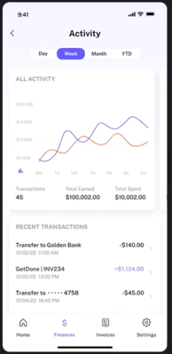

# The transactions screen («תנועות») Implementation Plan

> **For agentic workers:** REQUIRED SUB-SKILL: Use superpowers:executing-plans to
> implement this plan PR by PR. Steps use checkbox (`- [ ]`) syntax. **The step
> order is CLAUDE.md's, not TDD's**: production code, approval, commit; then the
> first three tests, each watched failing against its own break, approval; then
> the rest, approval, commit. Every STOP below is a real stop.

**Goal:** Ship `/transactions` — a per-account balance chart and a transaction
list — and turn the inert `תנועות` tab on.

**Reference:**



**Architecture:** One server read (`settleInterest`) settles interest and
returns every visible account's wallets *and* transactions; the page ships a
five-field projection to a client shell. Two pure derivations in `src/lib`
(`balance-history.ts`, `transaction-rows.ts`) do all the arithmetic; the
components only draw. The chart is a hand-rolled SVG whose geometry lives in
pure, tested helpers beside it.

**Tech Stack:** Next.js 16 App Router (server components), React 19, Emotion
(with `stylis-plugin-rtl`), Jest + Testing Library, `node:test` + puppeteer for
`e2e/*.visual.ts`.

**Spec:** `docs/superpowers/specs/2026-09-23-transactions-design.md`. The
mockup `mockups/account-summary/transactions.html` + `account-summary.js` is the
specification of record for anything either document leaves open. Read both
before any PR.

## Where it stands (2026-09-23)

Spec and plan merged as #119. **PR 1 merged as #122** — the chart-line colours
are on `main`, so PR 7 now waits only on PR 6. **PR 2 merged as #125** — every
store lists an account's whole ledger, oldest first. **PR 3 merged as #129** —
one read settles interest and hands back each child's wallets and history, so
lane B is done and PR 6 now waits only on PR 4.

### Lanes — who can run in parallel

Nine PRs in three lanes, one join, one fork, one finish. **Inside a lane**, each
PR branches off `main` once the one before it has merged — the method page's
stack was rebased twice because branches were cut from each other instead.
**Across lanes**, PRs touch disjoint files and run at the same time.

| Wave | Lane A | Lane B | Lane C | Starts when |
| --- | --- | --- | --- | --- |
| 1 | PR 1 — theme tokens ✓ #122 | PR 2 ✓ #125 → PR 3 ✓ #129 — store, then `settleInterest` | PR 4 → PR 5 — `balance-history`, then `transaction-rows` | now |
| 2 | PR 6 — route, shell, headline | — | — | PRs 3 and 4 merged |
| 3 | PR 7 — chart | PR 8 — list | — | PR 6 merged; PR 7 also needs PR 1, PR 8 needs PR 5 |
| 4 | PR 9 — tab and browser suite | — | — | PRs 7 and 8 merged |

- **Only shared file in wave 1:** `src/lib/dates.ts`, where PR 5 adds `calendarMonth`.
  Nothing else in wave 1 touches it.
- **PRs 7 and 8 both edit `use-transactions-view.ts` and `Transactions.tsx`.**
  Each adds its own state and one line of JSX. Whichever merges second rebases
  onto the first. Everything else they touch is disjoint.

**Running sessions side by side:**
- One worktree per session, one writer each:
  `git worktree add ../fun-saver-<lane> -b <branch> origin/main`. Then copy
  `.env.local` and `node_modules` into it, or run `npm install` there.
- Never use a bare `git stash`. The stash stack is shared across every worktree.
- `npm run test:db` and `npm run test:e2e` run from one session at a time. Both
  hit the shared Neon dev database. `jest`, `tsc` and `eslint` are safe to run
  in parallel.
- Only the driving session edits this plan and the spec. Each lane reports its
  merged PR numbers here through that session.

**What blocks what:** nothing. Decisions A–E were all settled on 2026-09-23, so
no PR waits on the user for a decision.

## Global Constraints

- Hebrew only, RTL, inherited from the root layout's `dir="rtl"`. No English copy.
- No new dependency. No new API route. No migration, no new index.
- Amounts are integer agorot everywhere below the component layer.
- Days are UTC `YYYY-MM-DD` strings, as `today()` and `occurredAt` already are.
- No colour literal (`#hex`, `rgba(`, `hsla(`) in any `.tsx`, `.styles.ts`,
  `constants.ts` or `-parts.ts` under `src/components` — `no-color-leaks.test.ts`.
- Colours from `theme.colors` / `theme.gradients`; font sizes from
  `theme.typography` (`display 48 · amount 38 · title 22 · heading 18 · body 15 ·
  label 12`), snapping a mockup's in-between size to the nearest step. Spacing,
  radii, shadows are literals written inline in the `.styles.ts` — no `*_STYLE`
  object.
- Emotion runs `stylis-plugin-rtl`, which **mirrors physical CSS** (`left` ↔
  `right`). Anything the mockup pins to a physical side is written with logical
  properties (`inset-inline-end`, `inset-block-end`) so the plugin cannot flip it.
- 200 lines per file, 40 per function (blank lines and comments not counted).
  Extract; never compress.
- No comments in source. Single quotes, named exports (Next's `page.tsx`
  default export excepted), explicit return types on every function.
- Styles in `<Component>.styles.ts`; test ids and copy in `constants.ts`; a
  component that composes, branches or maps gets its own folder and test.
- Tests: `data-testid` from constants, `render()` in `beforeEach`, names in
  domain language, expectations flowing through the helper the code uses (never
  a hardcoded helper output), any theme assertion on a **non-default** theme id.
  Driver classes only under `e2e/driver/`; unit-test helpers are functions in
  `src/test-utils/`.
- Any fixture with more than one deposit sets each deposit's `createdAt`
  explicitly — `createMockTransaction` defaults every row to the same instant.
- Tool output you will report as a number comes from `./node_modules/.bin/<tool>`,
  not `rtk`.

## Review Focus

Inputs the spec implies and nothing else tests, most likely first. Each line's
test is added to the PR that owns the code.

1. **The first day of a month's interest reads `1 ימים`.** Every month's current
   bucket has one day on the 1st, and a brand-new account reads `1 שורות · 1 יום`.
   Expected: `יום אחד`, `שורה אחת`. → PR 8, `TransactionList` / `TransactionRow`.
2. **A young account on a wide range prints the same date twice.** Three days of
   history on `שבוע`: the tick indices round to `0, 1, 1, 2`. Expected: each
   date once. → PR 7, `axis-ticks.ts`.
3. **A line that did not move in the range.** Spending alone over a quiet week
   has `max === min`; the mockup's `span || 1` pins it to the bottom edge, where
   it reads as zero, under three identical ticks. Expected: the line at
   mid-height and one tick. → PR 7, `chart-geometry.ts`.
4. **Switching to a child with no transactions while lines and a range are
   selected.** An empty history makes `Math.min()` return `Infinity`. Expected:
   the no-transactions state, and the chosen range and lines kept for the next child.
   → PR 7, `BalanceChart`; PR 8, `TransactionList`.
5. **A badge or swatch positioned with physical CSS.** The RTL plugin mirrors
   `left: -5px` to the right-hand corner. Expected: the badge at the corner the
   mockup draws. → PR 8 (logical properties), asserted in PR 9's visual suite.

---

## Decisions this plan takes (review these first)

Each refines or corrects the spec. None re-opens an approved design call.

1. **Today sits at the left edge, not the right.** The spec's RTL section says
   "newest at the right edge". The mockup — the specification of record — has
   `nearX = PAD.near` (6) for today and the y ticks at the far, right-hand edge,
   so time reads right-to-left and ends on the left where an RTL line ends. The
   port follows the mockup, and the spec's sentence is corrected in PR 9.
2. **Wallets are split by `filter`, not by a bucket map.** The spec seeds a map
   bucket per wallet so an empty wallet does not read `undefined`.
   `transactions.filter((row) => row.walletId === wallet.id)` per wallet cannot
   produce `undefined` at all — three passes over ~1,000 rows. The empty-wallet
   test stays.
3. **`balance-history.ts` does not sort; it cannot care.** It sums signed amounts
   per day and takes the earliest `occurredAt`, and both are independent of
   order. The "insertion order and sorted order give the same history" test pins
   that. `transaction-rows.ts` is the one that sorts.
4. **Two deposits or withdrawals on one day order by `createdAt`, newest first.** The spec
   uses `createdAt` only to group deposits, and leaves the order of two
   same-day transactions to whatever order the store returned. For a deposit or
   withdrawal `createdAt` *is* the event time (`new Date()` at write); only
   interest's is settlement time, and interest is ranked separately. This is the
   tiebreak.
5. **Single-select controls are native radio inputs** in a `fieldset` with a
   visually hidden `legend`, styled as chips. The spec asks for one group with
   one checked option; native radios are that, with arrow-key movement and
   one tab stop for free. There is no `radiogroup` in the app to copy, and a
   hand-rolled one owes roving `tabindex`. One shared `ChoiceChips` serves the
   ranges, the type filters and the interest switch.
6. **The change pill does not use `Money`.** The spec keeps it on `Money`, but
   the pill is always signed and `Money` renders a negative as `₪-12` — the exact
   defect the spec lists against the change column. The pill and the change
   column share one `SignedAmount` (`+₪12`, `-₪12`); the headline and the
   balance column keep `Money`.
7. **`TypeFilters` and `InterestMode` are not folders.** Each would be a
   `ChoiceChips` with an options array and nothing else — a component that does
   nothing. `TransactionList` renders `ChoiceChips` twice.
8. **A flat range draws at mid-height with one tick.** When `max === min` the y
   scale returns mid-height, and the tick values are rounded to whole agorot and
   de-duplicated. That is what keeps Review Focus 3 from printing `₪18 ₪18 ₪18`.
9. **A direct label's swatch sits at the label's today-side end.** SVG cannot
   measure text, so a swatch at the text's start (its right edge) has no x.
   Placed at the left, between the line's end and the name, it also reads as
   the line's endpoint.
10. **The total's area fill uses `fill-opacity` on `textStrong`.** It is the one
    opacity on a themed colour in the screen, and it is the spec's call: a 7%
    fill paints no text and carries no contrast bar. `CHART_FILL_OPACITY` in
    `BalanceChart/constants.ts`.

## Decisions owed, and settled

All five were settled on 2026-09-23. B–E took the proposals below; A was
settled against `mockups/chart-contrast.html`, drawn during the decision.

| # | Question | Needed before | Answer |
| --- | --- | --- | --- |
| A | `sunshine-quest`'s savings and spending chart lines | PR 1 | **settled** — green savings `#276E2C` (6.26, the value of `gainText`) · blue spending `#2563EB` (5.17) · pink good `#E94E89` (3.55). The proposal `#B07D00` · `#E2661F` and every orange spending were rejected: spending read too close to good. `softText`'s brown for savings was rejected too |
| B | Type sizes the scale does not have: the 30px headline, the 9.5 / 9 SVG labels | PR 6 / PR 7 | **settled** — headline `amount` (38, the token named for it; 22 and 38 tie); SVG text stays in viewBox units, because the viewBox scales with the card and 12 crowds three y ticks into 112 units |
| C | No-history copy, for the chart frame and for the list | PR 7 | **settled** — chart `עוד אין תנועות להציג`, list `כאן יופיעו ההפקדות, המשיכות והריבית` |
| D | The savings withdrawal's name and badge | PR 8 | **settled** — `🏦 משיכה` |
| E | The rolled-up interest row's name | PR 8 | **settled** — `ריבית`, with the month coming from the section header (the spec's lean) |

## Every PR runs the same loop

- [ ] `rtk proxy git fetch origin && rtk proxy git checkout -b <branch> origin/main`
- [ ] Outline the PR to the user. **STOP** for approval.
- [ ] Write the production code listed. Run `./node_modules/.bin/tsc --noEmit`
      and `./node_modules/.bin/eslint <touched files>`. **STOP** for review.
- [ ] On "commit": commit the production code (message given per PR, ending
      with the `Co-Authored-By` line).
- [ ] Write the **first three** tests listed. For each one: `cp` the file under
      test aside, apply the break named beside the test, run, read *which* test
      reddens, restore from the copy, `cmp` it. **STOP** for approval.
- [ ] Write the rest, each watched failing against its own break the same way.
      Run `./node_modules/.bin/jest` on the whole suite. **STOP**; on
      "commit tests", commit.
- [ ] Push and open the PR only when asked. A visible change gets screenshots
      through the `pr-screenshots` skill. The PR body follows the saved
      five-section template.

---

## PR 1 — the chart lines get colours they can be seen in

Branch `feat/chart-line-tokens`. Spec: "Colours", delivery order 1.
**Merged as #122 on 2026-09-23.**

**Files:**
- Modify: `src/theme/theme-tokens.ts` (`ThemeColors`)
- Modify: `src/theme/palette.ts`, `src/theme/themes/jungle-quest.ts`, `src/theme/themes/midnight-blue.ts`
- Modify: `src/test-utils/css-color.ts` (a contrast helper)
- Create: `mockups/chart-contrast.html` (drawn *during* decision A, records the rejected options)
- Test: `src/theme/__tests__/chart-lines.test.ts`

**Interfaces:**
- Produces: `theme.colors.chartSavings`, `chartSpending`, `chartGoodDeeds`, which PR 7
  reads through `WALLET_CHART_COLOR`. `contrastRatio(a, b): number` in
  `src/test-utils/css-color.ts`.

- [x] **Step 1: Settle decision A.** Settled 2026-09-23: green `#276E2C` · blue
      `#2563EB` · pink `#E94E89`. `mockups/chart-contrast.html` draws the sunshine
      chart card eight ways over the same four lines and records why each other
      option was rejected.
- [x] **Step 2: Add the three keys to `ThemeColors`**, after `walletTrack`:

```ts
  readonly chartSavings: string;
  readonly chartSpending: string;
  readonly chartGoodDeeds: string;
```

- [x] **Step 3: Add the nine values.**

```ts
// src/theme/palette.ts (sunshine-quest), after walletTrack
  chartSavings: '#276E2C',
  chartSpending: '#2563EB',
  chartGoodDeeds: '#E94E89',

// src/theme/themes/jungle-quest.ts
    chartSavings: '#2A9D8F',
    chartSpending: '#6E9B22',
    chartGoodDeeds: '#E76F51',

// src/theme/themes/midnight-blue.ts
    chartSavings: '#60A5FA',
    chartSpending: '#38BDF8',
    chartGoodDeeds: '#A78BFA',
```

- [x] **Step 4: Add the helper** to `src/test-utils/css-color.ts`:

```ts
function channel(value: number): number {
  const ratio = value / 255;
  return ratio <= 0.03928 ? ratio / 12.92 : ((ratio + 0.055) / 1.055) ** 2.4;
}

function luminance(hex: string): number {
  const value = parseInt(hex.slice(1), 16);
  const [red, green, blue] = [(value >> 16) & 255, (value >> 8) & 255, value & 255].map(channel);
  return 0.2126 * red + 0.7152 * green + 0.0722 * blue;
}

export function contrastRatio(first: string, second: string): number {
  const [lighter, darker] = [luminance(first), luminance(second)].sort((a, b) => b - a);
  return (lighter + 0.05) / (darker + 0.05);
}
```

- [x] **Step 5: tsc, eslint, STOP, commit** —
      `feat(theme): the chart lines get colours they can be seen in`
- [x] **Step 6: The tests** — all three are the first three; there are no more.
      As shipped, one `describe.each` per theme:

```ts
import { THEMES } from '../registry';
import { contrastRatio } from '@/test-utils/css-color';

const GRAPHIC_CONTRAST = 3;

describe.each(Object.entries(THEMES))('the chart lines in %s', (_, { colors }) => {
  const lines = [colors.chartSavings, colors.chartSpending, colors.chartGoodDeeds];

  it('stand out from the card they are drawn on', () => {
    const ratios = lines.map((line) => contrastRatio(line, colors.surface));
    expect(Math.min(...ratios)).toBeGreaterThanOrEqual(GRAPHIC_CONTRAST);
  });

  it('never draw two lines in one colour', () => {
    const drawn = [...lines, colors.textStrong];
    expect(new Set(drawn).size).toBe(drawn.length);
  });
});

it('measures a contrast ratio the way the contrast passes did', () => {
  expect(contrastRatio('#FFFFFF', '#000000')).toBeCloseTo(21);
});
```

Breaks: set sunshine `chartSavings` back to the mockup's `#E0A020` (first test
reddens for `sunshine-quest` only); set midnight `chartSpending` to `#60A5FA`
(second test reddens); drop the `+ 0.05` from `contrastRatio` (third reddens).

The measured table lives in the spec's "Colours" section, not the PR body,
which stays in domain language. Jungle `#E76F51` at 3.04 is measured and left
alone; midnight's donut `walletSavings` at 1.99 is out of scope.

---

## PR 2 — a store can list an account's whole ledger

Branch `feat/list-by-account`. Spec: "Store contract".
**Merged as #125 on 2026-09-23.** What shipped differs from the steps below:
review made every store return oldest first, so the memory and json-file
repositories sort through `inOrderOfOccurrence` (`src/db/transaction-order.ts`) in both
`listByAccount` and `listByWallet`, and the tests reuse `mockTransactions`. The
code on `main` is the record.

**Files:**
- Modify: `src/db/data-store.ts:26-29` (`TransactionRepository`), `:55-59` (`DataStore`)
- Modify: `src/db/repository-store.ts` (delegate)
- Modify: `src/db/memory-store/transactions.ts`, `src/db/json-file-store/transactions.ts`, `src/db/postgres-store/transactions.ts`
- Test: `src/db/memory-store/__tests__/transactions.test.ts`, `src/db/json-file-store/__tests__/transactions.test.ts`, `src/db/postgres-store/__tests__/transactions.e2e.ts`

**Interfaces:**
- Produces: `DataStore.listTransactionsByAccount(accountId: string): Promise<Transaction[]>`,
  which PR 3 is the first caller of. Every store returns it oldest first
  (`occurred_at, created_at, id`).

- [ ] **Step 1: The contract.**

```ts
// TransactionRepository
  listByAccount(accountId: string): Promise<Transaction[]>;

// DataStore, after listTransactionsByWallet
  listTransactionsByAccount(accountId: string): Promise<Transaction[]>;

// RepositoryStore
  listTransactionsByAccount(accountId: string): Promise<Transaction[]> {
    return this.transactions.listByAccount(accountId);
  }
```

- [ ] **Step 2: The three repositories.**

```ts
// MemoryTransactions
  async listByAccount(accountId: string): Promise<Transaction[]> {
    return this.transactions.filter((transaction) => transaction.accountId === accountId);
  }

// JsonTransactions
  listByAccount(accountId: string): Promise<Transaction[]> {
    return this.session.read((contents): Transaction[] =>
      contents.transactions.filter((transaction) => transaction.accountId === accountId)
    );
  }

// PostgresTransactions
  async listByAccount(accountId: string): Promise<Transaction[]> {
    const rows = await queryRows<TransactionRow>(
      this.sql,
      `SELECT * FROM transactions
       WHERE account_id = $1
       ORDER BY occurred_at, created_at, id`,
      [accountId]
    );

    return rows.map(transactionFromRow);
  }
```

- [ ] **Step 3: tsc, eslint, STOP, commit** —
      `feat(db): a store can list an account's whole ledger`
- [ ] **Step 4: First three tests.**

```ts
// memory-store/__tests__/transactions.test.ts, inside the describe
  it('lists every wallet of the account, and nothing of anyone else', async () => {
    const store = new InMemoryStore();
    await store.insertTransactions([
      createMockTransaction(),
      createMockTransaction({ id: 't2', walletId: 'w2' }),
      createMockTransaction({ id: 't3', accountId: 'a2' }),
    ]);

    const ids = (await store.listTransactionsByAccount('a1')).map((row) => row.id);

    expect(ids.sort()).toEqual(['t1', 't2']);
  });

// json-file-store/__tests__/transactions.test.ts
  it('lists the whole ledger again after a reopen', async () => {
    const store = new JsonFileStore(file.path);
    await store.insertAccount(mockAccount);
    await store.insertTransactions([deposit, createMockTransaction({ id: 't2', walletId: 'w2' })]);

    const reopened = new JsonFileStore(file.path);
    const ids = (await reopened.listTransactionsByAccount('a1')).map((row) => row.id);

    expect(ids.sort()).toEqual(['t1', 't2']);
  });

// postgres-store/__tests__/transactions.e2e.ts
  it('lists an account across its wallets and never another account', async () => {
    const mockAccountA = createMockAccount({ id: accountId('a') });
    const mockAccountB = createMockAccount({ id: accountId('b') });
    await store.insertAccount(mockAccountA);
    await store.insertAccount(mockAccountB);
    await store.insertTransactions([
      createMockTransaction({ id: transactionId('a1'), accountId: mockAccountA.id, walletId: 'savings' }),
      createMockTransaction({ id: transactionId('a2'), accountId: mockAccountA.id, walletId: 'spending' }),
      createMockTransaction({ id: transactionId('b1'), accountId: mockAccountB.id, walletId: 'savings' }),
    ]);

    const accountATransactions = await store.listTransactionsByAccount(mockAccountA.id);
    const accountBTransactions = await store.listTransactionsByAccount(mockAccountB.id);

    expect(accountATransactions.map((row) => row.id).sort()).toEqual([transactionId('a1'), transactionId('a2')]);
    expect(accountBTransactions.map((row) => row.id)).toEqual([transactionId('b1')]);
  });
```

Breaks: drop the `accountId` filter (the `WHERE`) in each implementation in turn.

- [ ] **Step 5: The rest.**

```ts
// postgres-store/__tests__/transactions.e2e.ts
  it('returns an account oldest first, ties broken by write time', async () => {
    const account = createMockAccount({ id: accountId('o') });
    await store.insertAccount(account);
    await store.insertTransactions([
      createMockTransaction({ id: transactionId('late'), accountId: account.id, createdAt: '2026-01-01T09:00:00.000Z' }),
      createMockTransaction({ id: transactionId('early'), accountId: account.id, createdAt: '2026-01-01T08:00:00.000Z' }),
    ]);

    const rows = await store.listTransactionsByAccount(account.id);

    expect(rows.map((row) => row.id)).toEqual([transactionId('early'), transactionId('late')]);
  });
```

Break: remove `created_at` from the `ORDER BY`. Run with `npm run test:db`
after confirming which Neon branch `DATABASE_URL` points at.

---

## PR 3 — one read serves both the wallets and the ledger

Branch `refactor/account-ledgers`. Spec: "The shared read", delivery order 2.
**Merged as #129 on 2026-09-23.**

What shipped differs from the steps below: each wallet is settled and derived in
one pass (`settleWalletInterest`, gathered by `settleAccountInterest`), so the per-wallet
split happens once; the names say what the code does; and the tests reuse the
shared fixtures under names in domain language. The history comes back oldest
first, the interest just paid sorted in, so the first visit reads like every
later one. The code on `main` is the record.

`/` and `/method` keep their behaviour; this PR changes nothing a parent sees.

**Files:**
- Modify: `src/lib/interest-settlement.ts` (whole file)
- Test: `src/lib/__tests__/interest-settlement.test.ts` (rewrite the
  `getWalletsForAccount` describe; the `summarizeAccounts` describe stays)

**Interfaces:**
- Consumes: `store.listTransactionsByAccount` (PR 2).
- Produces:

```ts
export interface SettledAccount {
  account: AccountSummary;
  transactions: Transaction[];
}
export function settleInterest(query: SettleInterestParams): Promise<SettledAccount[]>;
export async function summarizeAccounts(query: SettleInterestParams): Promise<AccountSummary[]>;
```

`getWalletsForAccount` stops being exported — its only caller is
`summarizeAccounts` and its own test.

- [ ] **Step 1: The file.**

```ts
import type { DataStore } from '@/db/data-store';
import type {
  Account,
  AccountSummary,
  Transaction,
  Wallet,
  WalletName,
  WalletSummary,
} from './types';
import { summarizeWallet } from './summarize-wallet';
import { addDailyInterest } from './interest';

const WALLET_ORDER: Record<WalletName, number> = {
  savings: 0,
  spending: 1,
  goodDeeds: 2,
};

interface SettleInterestParams {
  store: DataStore;
  accounts: Account[];
  asOf: string;
}

interface SettleAccountInterestParams {
  store: DataStore;
  account: Account;
  asOf: string;
}

export interface SettledAccount {
  account: AccountSummary;
  transactions: Transaction[];
}

function walletRows(transactions: Transaction[], wallet: Wallet): Transaction[] {
  return transactions.filter((transaction) => transaction.walletId === wallet.id);
}

function accruedInterest(account: Account, stored: Transaction[], asOf: string): Transaction[] {
  return account.wallets.flatMap((wallet) =>
    addDailyInterest({
      wallet,
      transactions: walletRows(stored, wallet),
      asOf,
      accountId: account.id,
    })
  );
}

function derivedWallets(
  account: Account,
  settled: Transaction[],
  asOf: string
): WalletSummary[] {
  return account.wallets
    .map((wallet) => summarizeWallet({ wallet, transactions: walletRows(settled, wallet), asOf }))
    .sort((a, b) => WALLET_ORDER[a.name] - WALLET_ORDER[b.name]);
}

async function settleAccountInterest({ store, account, asOf }: SettleAccountInterestParams): Promise<SettledAccount> {
  const stored = await store.listTransactionsByAccount(account.id);
  const accrued = accruedInterest(account, stored, asOf);

  if (accrued.length > 0) {
    await store.insertTransactions(accrued);
  }

  const settled = [...stored, ...accrued];

  return {
    account: { ...account, wallets: derivedWallets(account, settled, asOf) },
    transactions: settled,
  };
}

export function settleInterest({ store, accounts, asOf }: SettleInterestParams): Promise<SettledAccount[]> {
  return Promise.all(accounts.map((account) => settleAccountInterest({ store, account, asOf })));
}

export async function summarizeAccounts(
  query: SettleInterestParams
): Promise<AccountSummary[]> {
  const settledAccounts = await settleInterest(query);

  return settledAccounts.map((settledAccount) => settledAccount.account);
}
```

- [ ] **Step 2: tsc, eslint, STOP, commit** —
      `refactor(dashboard): one read serves both the wallets and the ledger`
- [ ] **Step 3: First three tests.** Rename the `getWalletsForAccount` describe
      to `settleInterest` and move its three existing cases onto
      `(await settleInterest({ store, accounts: [account], asOf }))[0].account.wallets`.
      They count as the first three: ordering, compounded interest, no
      re-accrual. Breaks: drop the `.sort`; drop `...accrued` from `settled`;
      drop the `insertTransactions` call (the re-read test reddens).
- [ ] **Step 4: The rest.**

```ts
  it('derives a wallet nothing has happened to yet, as every new account has', async () => {
    const [settledAccount] = await settleInterest({ store, accounts: [account], asOf: '2026-01-03' });

    expect(settledAccount.account.wallets.map((wallet) => wallet.balance)).toEqual([0, 0]);
  });

  it('hands back the interest it just settled, so the ledger is never a day behind', async () => {
    const unsettled = createMockAccount({
      wallets: [createMockWallet({ lastInterestDate: '2026-01-01' })],
    });
    await store.insertTransactions([createMockTransaction({ occurredAt: '2026-01-01' })]);

    const [settledAccount] = await settleInterest({ store, accounts: [unsettled], asOf: '2026-01-03' });

    expect(settledAccount.transactions.filter((row) => row.type === 'interest')).toHaveLength(2);
  });

  it('leaves the store untouched when no interest is owed', async () => {
    const insert = jest.spyOn(store, 'insertTransactions');
    await settleInterest({ store, accounts: [account], asOf: '2026-01-01' });

    expect(insert).not.toHaveBeenCalled();
  });
```

Breaks: in turn, replace `walletRows` with a `Map` lookup that is not seeded (the
first reddens with a throw); return `stored` instead of `settled` (the second);
remove the `accrued.length > 0` guard (the third). The spy test earns its mock:
without the guard, the json-file store rewrites `data.json` on every render of
every screen.

---

## PR 4 — the balance, day by day

Branch `feat/balance-history`. Spec: "The graph" (the balance-history half), "Running
balance". Pure lib, nothing rendered.

**Files:**
- Modify: `src/lib/wallet-totals.ts` (export `balanceChange`)
- Modify: `src/lib/interest/add-daily-interest.ts` (drop its private `balanceChange`, import it from `wallet-totals`)
- Create: `src/lib/balance-history.ts`
- Test: `src/lib/__tests__/balance-history.test.ts`, `src/lib/__tests__/wallet-totals.test.ts`

**Interfaces:**

```ts
// wallet-totals.ts
export function balanceChange(transaction: Pick<Transaction, 'type' | 'amount'>): number;

// balance-history.ts
export type WalletBalances = Record<WalletName, number[]>;
export interface BalanceHistory { days: string[]; totalBalance: number[]; wallets: WalletBalances }
export interface BalanceHistoryInput {
  wallets: Pick<Wallet, 'id' | 'name'>[];
  transactions: Pick<Transaction, 'walletId' | 'type' | 'amount' | 'occurredAt'>[];
  asOf: string;
}
export function balanceHistory(input: BalanceHistoryInput): BalanceHistory;
export function balanceOverRange(history: BalanceHistory, rangeInDays: number): BalanceHistory;
export function todaysTotalBalance(history: BalanceHistory): number;
export function totalBalanceChange(history: BalanceHistory, rangeInDays: number): number;
export function totalBalanceByDay(history: BalanceHistory): Map<string, number>;
```

`rangeInDays` takes `Infinity` for `הכל`. `totalBalanceChange` takes the whole history, not the range,
because an account younger than the range carries in a balance of 0, which the range itself cannot show. `totalBalance[i]` is the account's
total balance at the **end** of `days[i]`. The transactions are the page's
projection: any object with those four fields, so a whole `Transaction` fits too.

- [ ] **Step 1: `balanceChange`** moves from `add-daily-interest.ts`, where it is
      private, to `wallet-totals.ts`, exported; `add-daily-interest.ts` imports it.

```ts
export function balanceChange(transaction: Pick<Transaction, 'type' | 'amount'>): number {
  return transaction.type === 'withdrawal' ? -transaction.amount : transaction.amount;
}
```

- [ ] **Step 2: `balance-history.ts`.**

```ts
import { DEFAULT_WALLETS } from './constants';
import { eachDayInclusive } from './dates';
import { balanceChange } from './wallet-totals';
import type { Transaction, Wallet, WalletName } from './types';

export type WalletBalances = Record<WalletName, number[]>;

export interface BalanceHistory {
  days: string[];
  totalBalance: number[];
  wallets: WalletBalances;
}

export interface BalanceHistoryInput {
  wallets: Pick<Wallet, 'id' | 'name'>[];
  transactions: Pick<
    Transaction,
    'walletId' | 'type' | 'amount' | 'occurredAt'
  >[];
  asOf: string;
}

const WALLET_NAMES: readonly WalletName[] = DEFAULT_WALLETS.map(
  (wallet) => wallet.name
);

function firstTransactionDay(
  transactions: Pick<Transaction, 'occurredAt'>[]
): string | undefined {
  const transactionDays = transactions
    .map((transaction) => transaction.occurredAt)
    .sort();

  return transactionDays[0];
}

function dailyBalanceChanges(
  transactions: Pick<Transaction, 'type' | 'amount' | 'occurredAt'>[]
): Map<string, number> {
  const balanceChangeByDay = new Map<string, number>();

  for (const transaction of transactions) {
    const day = transaction.occurredAt;
    const changeSoFar = balanceChangeByDay.get(day) ?? 0;
    balanceChangeByDay.set(day, changeSoFar + balanceChange(transaction));
  }

  return balanceChangeByDay;
}

function runningBalance(
  days: string[],
  transactions: BalanceHistoryInput['transactions']
): number[] {
  const balanceChangeByDay = dailyBalanceChanges(transactions);
  const balances: number[] = [];
  let balance = 0;

  for (const day of days) {
    balance += balanceChangeByDay.get(day) ?? 0;
    balances.push(balance);
  }

  return balances;
}

function walletTransactions(
  walletName: WalletName,
  { wallets, transactions }: BalanceHistoryInput
): BalanceHistoryInput['transactions'] {
  const wallet = wallets.find((candidate) => candidate.name === walletName);

  return transactions.filter(
    (transaction) => transaction.walletId === wallet?.id
  );
}

function totalBalances(
  walletBalances: WalletBalances,
  days: string[]
): number[] {
  const totalBalanceOn = (dayIndex: number): number =>
    WALLET_NAMES.reduce(
      (totalBalance, walletName) =>
        totalBalance + walletBalances[walletName][dayIndex],
      0
    );

  return days.map((_, dayIndex) => totalBalanceOn(dayIndex));
}

function perWallet(
  balancesOf: (walletName: WalletName) => number[]
): WalletBalances {
  return {
    savings: balancesOf('savings'),
    spending: balancesOf('spending'),
    goodDeeds: balancesOf('goodDeeds'),
  };
}

export function balanceHistory(input: BalanceHistoryInput): BalanceHistory {
  const firstDay = firstTransactionDay(input.transactions);
  const hasNoTransactions = firstDay === undefined;
  const days = hasNoTransactions ? [] : eachDayInclusive(firstDay, input.asOf);
  const wallets = perWallet((walletName) =>
    runningBalance(days, walletTransactions(walletName, input))
  );

  return { days, totalBalance: totalBalances(wallets, days), wallets };
}

function carriedInDayIndex(
  history: BalanceHistory,
  rangeInDays: number
): number {
  const todayIndex = history.days.length - 1;

  return todayIndex - rangeInDays;
}

export function balanceOverRange(
  history: BalanceHistory,
  rangeInDays: number
): BalanceHistory {
  const rangeStartIndex = Math.max(0, carriedInDayIndex(history, rangeInDays));
  const fromRangeStart = <T>(values: T[]): T[] => values.slice(rangeStartIndex);

  return {
    days: fromRangeStart(history.days),
    totalBalance: fromRangeStart(history.totalBalance),
    wallets: perWallet((walletName) =>
      fromRangeStart(history.wallets[walletName])
    ),
  };
}

function closingBalance(values: number[]): number {
  return values[values.length - 1] ?? 0;
}

export function todaysTotalBalance(history: BalanceHistory): number {
  return closingBalance(history.totalBalance);
}

export function totalBalanceChange(
  history: BalanceHistory,
  rangeInDays: number
): number {
  const carriedInDay = carriedInDayIndex(history, rangeInDays);
  const accountIsYoungerThanRange = carriedInDay < 0;
  const carriedInTotalBalance = accountIsYoungerThanRange
    ? 0
    : history.totalBalance[carriedInDay];

  return todaysTotalBalance(history) - carriedInTotalBalance;
}

export function totalBalanceByDay(
  history: BalanceHistory
): Map<string, number> {
  return new Map(
    history.days.map((day, dayIndex) => [day, history.totalBalance[dayIndex]])
  );
}
```

  A range of `N` days holds `N + 1` points: the balance carried in, then each of
  the `N` days. That is the mockup's `windowStart = DAYS - range`.

- [ ] **Step 3: tsc, eslint, STOP, commit** — `feat(lib): the balance, day by day`
- [ ] **Step 4: First three tests** (`balance-history.test.ts`; fixtures from
      `createMockWallets()` and `createMockTransaction`, whose `w1/w2/w3` are
      savings/spending/goodDeeds; shared stand-ins live inside the `describe`):

```ts
import {
  balanceHistory,
  balanceOverRange,
  type BalanceHistory,
} from '../balance-history';
import { eachDayInclusive } from '../dates';
import type { Transaction } from '../types';
import {
  createMockTransaction,
  createMockWallets,
} from '@/test-utils/fixtures';

describe('the balance history', () => {
  const mockWallets = createMockWallets();
  const mockOpeningDeposit = createMockTransaction({
    id: 'opening',
    amount: 500,
    occurredAt: '2026-01-01',
  });

  const historyOf = (
    transactions: Transaction[],
    asOf: string
  ): BalanceHistory =>
    balanceHistory({ wallets: mockWallets, transactions, asOf });

  it('carries a balance across the days nothing happened', () => {
    const history = historyOf([mockOpeningDeposit], '2026-01-03');
    const firstThreeDays = eachDayInclusive('2026-01-01', '2026-01-03');

    expect(history.days).toEqual(firstThreeDays);
    expect(history.totalBalance).toEqual([500, 500, 500]);
  });

  it('gives the same history whichever order the store returned the transactions in', () => {
    const mockSameDayDeposit = createMockTransaction({
      id: 'deposit',
      amount: 300,
      occurredAt: '2026-01-02',
    });
    const mockSameDayWithdrawal = createMockTransaction({
      id: 'withdrawal',
      type: 'withdrawal',
      amount: 200,
      occurredAt: '2026-01-02',
    });
    const unsortedTransactions = [
      mockSameDayDeposit,
      mockOpeningDeposit,
      mockSameDayWithdrawal,
    ];
    const sortedTransactions = [...unsortedTransactions].sort((a, b) =>
      a.occurredAt.localeCompare(b.occurredAt)
    );

    expect(historyOf(unsortedTransactions, '2026-01-02')).toEqual(
      historyOf(sortedTransactions, '2026-01-02')
    );
  });

  it('starts a narrow range at the balance carried into it, not at zero', () => {
    const mockLaterDeposit = createMockTransaction({
      id: 'later',
      amount: 100,
      occurredAt: '2026-01-10',
    });
    const history = historyOf(
      [mockOpeningDeposit, mockLaterDeposit],
      '2026-01-10'
    );

    const lastWeek = balanceOverRange(history, 7);
    const openingBalance = lastWeek.totalBalance[0];

    expect(openingBalance).toBe(mockOpeningDeposit.amount);
  });
});
```

Breaks: `balance += …` → `balance = …` (first); take the first transaction's
`occurredAt` instead of the earliest (second); rebase the total balance to zero
at the range start — `fromRangeStart(history.totalBalance).map((value) => value - history.totalBalance[rangeStartIndex])`,
the very failure the spec names (third).

- [ ] **Step 5: The rest**, each with its break:
  - `'has no days for an account with no transactions'` —
    `transactions: []` gives `days`, `totalBalance` and every wallet's balances
    `[]`. Break: default `firstDay` to `asOf`.
  - `'is one day for an account whose whole history is today'` — one transaction on
    `asOf`, `days.length` is 1. Break: `eachDayInclusive(addDays(firstDay, -1), asOf)`.
  - `'keeps each wallet’s balance apart'` — deposits in `w1` and `w2`, withdrawal
    in `w2`; `wallets.spending` reflects only `w2`, `totalBalance` equals the sum of
    the three wallets. Break: `walletTransactions` ignores the wallet name.
  - `'shows the whole history when the account is younger than the range'` — a
    five-day history over a range of 7 equals the history, and so does
    `balanceOverRange(history, Infinity)`. Break: remove `Math.max(0, …)` —
    `rangeStartIndex` goes to `-3` and `slice` quietly keeps the last three days.
  - `'reports how much the total balance changed across the range'` — `totalBalanceChange(history, 7)`
    of the ten-day history above is `100`. Break: carry in `0` instead of the balance before the range.
  - `'counts the deposit as growth, for the week and since the beginning'` and
    `'counts every deposit since the account opened'` — an account younger than the range: five
    days after a 500 deposit the change is 500 for `7` and for `Infinity`, and a second deposit
    adds to it. Break: carry in the first day's balance, which already holds the first deposit.
  - `'reads the total balance a day ended on'` — `totalBalanceByDay(history).get('2026-01-10')` is `600`.
  - `wallet-totals.test.ts`: `'counts a withdrawal against the balance and everything else for it'`
    — `balanceChange` of a withdrawal of 200 is `-200`, of interest 5 is `5`.
    Break: return `transaction.amount`. Also run `interest.test.ts` untouched —
    it covers the `add-daily-interest` import.

---

## PR 5 — what happened, row by row

Branch `feat/transaction-rows`. Spec: "The list" — deposits, rollup, running
balance, ordering, sections, filters. Pure lib, nothing rendered; no copy lives
here, so decisions D and E do not block it.

**Files:**
- Modify: `src/lib/dates.ts` (`calendarMonth`)
- Create: `src/lib/transaction-rows.ts`
- Test: `src/lib/__tests__/transaction-rows.test.ts`, `src/lib/__tests__/dates.test.ts`

**Interfaces:**
- Consumes: `balanceChange` (PR 4, in `wallet-totals`); `BalanceHistory`, `totalBalanceByDay` (PR 4).
- Produces:

```ts
export type InterestMode = 'monthly' | 'daily';
export type TransactionTypeFilter = 'all' | TransactionType;
export interface TransactionListRow {
  key: string;
  type: TransactionType;
  walletName?: WalletName;
  day: string;
  amount: number;
  balance: number;
  interestDays?: number;
  createdAt: string;
}
export interface MonthSection { month: string; rows: TransactionListRow[] }
export interface TransactionListRowsInput {
  transactions: Omit<Transaction, 'id' | 'accountId'>[];
  wallets: Pick<Wallet, 'id' | 'name'>[];
  balanceHistory: BalanceHistory;
  interestMode: InterestMode;
}
export function transactionListRows(input: TransactionListRowsInput): TransactionListRow[];
export function filterByTransactionType(rows: TransactionListRow[], filter: TransactionTypeFilter): TransactionListRow[];
export function monthSections(rows: TransactionListRow[]): MonthSection[];
// dates.ts
export function calendarMonth(iso: string): string;
```

`amount` is signed. `walletName` is absent on a deposit — a deposit has no one
wallet. `interestDays` is set only on a monthly rollup. `month` is `YYYY-MM`.

- [ ] **Step 1: `calendarMonth`** in `dates.ts`:

```ts
const MONTH_LENGTH = 7;

export function calendarMonth(iso: string): string {
  return iso.slice(0, MONTH_LENGTH);
}
```

- [ ] **Step 2: `transaction-rows.ts`.** Split across two files if it crosses
      200 lines: the four row builders into `transaction-row-builders.ts`, the
      public three staying here.

```ts
import { totalBalanceByDay, type BalanceHistory } from './balance-history';
import { calendarMonth } from './dates';
import { balanceChange } from './wallet-totals';
import type { Transaction, TransactionType, Wallet, WalletName } from './types';

export type InterestMode = 'monthly' | 'daily';
export type TransactionTypeFilter = 'all' | TransactionType;

export interface TransactionListRow {
  key: string;
  type: TransactionType;
  walletName?: WalletName;
  day: string;
  amount: number;
  balance: number;
  interestDays?: number;
  createdAt: string;
}

export interface MonthSection {
  month: string;
  rows: TransactionListRow[];
}

export interface TransactionListRowsInput {
  transactions: Omit<Transaction, 'id' | 'accountId'>[];
  wallets: Pick<Wallet, 'id' | 'name'>[];
  balanceHistory: BalanceHistory;
  interestMode: InterestMode;
}

type RowWithoutBalance = Omit<TransactionListRow, 'balance'>;
type ListedTransaction = TransactionListRowsInput['transactions'][number];
type WalletNameById = Map<string, WalletName>;

function walletNamesById(wallets: TransactionListRowsInput['wallets']): WalletNameById {
  return new Map(wallets.map((wallet) => [wallet.id, wallet.name]));
}

function transactionsOfType(transactions: ListedTransaction[], type: TransactionType): ListedTransaction[] {
  return transactions.filter((transaction) => transaction.type === type);
}

function depositRows(transactions: ListedTransaction[]): RowWithoutBalance[] {
  const depositRowByCreatedAt = new Map<string, RowWithoutBalance>();

  for (const transaction of transactionsOfType(transactions, 'deposit')) {
    const row = depositRowByCreatedAt.get(transaction.createdAt);

    if (row) {
      row.amount += transaction.amount;
      continue;
    }

    depositRowByCreatedAt.set(transaction.createdAt, {
      key: `deposit:${transaction.createdAt}`,
      type: 'deposit',
      day: transaction.occurredAt,
      amount: transaction.amount,
      createdAt: transaction.createdAt,
    });
  }

  return [...depositRowByCreatedAt.values()];
}

function withdrawalRows(transactions: ListedTransaction[], walletNameById: WalletNameById): RowWithoutBalance[] {
  return transactionsOfType(transactions, 'withdrawal').map((transaction) => ({
    key: `withdrawal:${transaction.walletId}:${transaction.createdAt}`,
    type: 'withdrawal',
    walletName: walletNameById.get(transaction.walletId),
    day: transaction.occurredAt,
    amount: -transaction.amount,
    createdAt: transaction.createdAt,
  }));
}

function dailyInterestRows(transactions: ListedTransaction[], walletNameById: WalletNameById): RowWithoutBalance[] {
  return transactionsOfType(transactions, 'interest').map((transaction) => ({
    key: `interest:${transaction.walletId}:${transaction.occurredAt}`,
    type: 'interest',
    walletName: walletNameById.get(transaction.walletId),
    day: transaction.occurredAt,
    amount: transaction.amount,
    createdAt: '',
  }));
}

function monthlyInterestRows(transactions: ListedTransaction[], walletNameById: WalletNameById): RowWithoutBalance[] {
  const monthlyInterestRowByKey = new Map<string, RowWithoutBalance>();

  for (const dailyRow of dailyInterestRows(transactions, walletNameById)) {
    const key = `interest:${dailyRow.walletName}:${calendarMonth(dailyRow.day)}`;
    const monthlyRow = monthlyInterestRowByKey.get(key);

    if (!monthlyRow) {
      monthlyInterestRowByKey.set(key, { ...dailyRow, key, interestDays: 1 });
      continue;
    }

    monthlyRow.amount += dailyRow.amount;
    monthlyRow.interestDays = (monthlyRow.interestDays ?? 0) + 1;
    monthlyRow.day = dailyRow.day > monthlyRow.day ? dailyRow.day : monthlyRow.day;
  }

  return [...monthlyInterestRowByKey.values()];
}

function dailyDepositsAndWithdrawals(transactions: ListedTransaction[]): Map<string, number> {
  const depositsAndWithdrawalsByDay = new Map<string, number>();

  for (const transaction of transactions) {
    if (transaction.type === 'interest') {
      continue;
    }

    const day = transaction.occurredAt;
    const changeSoFar = depositsAndWithdrawalsByDay.get(day) ?? 0;
    depositsAndWithdrawalsByDay.set(day, changeSoFar + balanceChange(transaction));
  }

  return depositsAndWithdrawalsByDay;
}

function withBalances(rows: RowWithoutBalance[], input: TransactionListRowsInput): TransactionListRow[] {
  const endOfDayTotalBalance = totalBalanceByDay(input.balanceHistory);
  const depositsAndWithdrawalsByDay = dailyDepositsAndWithdrawals(input.transactions);

  return rows.map((row) => {
    const depositsAndWithdrawalsThatDay =
      row.type === 'interest' ? (depositsAndWithdrawalsByDay.get(row.day) ?? 0) : 0;

    return { ...row, balance: (endOfDayTotalBalance.get(row.day) ?? 0) - depositsAndWithdrawalsThatDay };
  });
}

function interestRank(row: TransactionListRow): number {
  return row.type === 'interest' ? 1 : 0;
}

function newestFirst(a: TransactionListRow, b: TransactionListRow): number {
  return (
    b.day.localeCompare(a.day) ||
    interestRank(a) - interestRank(b) ||
    b.createdAt.localeCompare(a.createdAt)
  );
}

export function transactionListRows(input: TransactionListRowsInput): TransactionListRow[] {
  const walletNameById = walletNamesById(input.wallets);
  const interestRows = input.interestMode === 'daily' ? dailyInterestRows : monthlyInterestRows;
  const rows = [
    ...depositRows(input.transactions),
    ...withdrawalRows(input.transactions, walletNameById),
    ...interestRows(input.transactions, walletNameById),
  ];

  return withBalances(rows, input).sort(newestFirst);
}

export function filterByTransactionType(rows: TransactionListRow[], transactionTypeFilter: TransactionTypeFilter): TransactionListRow[] {
  return transactionTypeFilter === 'all' ? rows : rows.filter((row) => row.type === transactionTypeFilter);
}

export function monthSections(rows: TransactionListRow[]): MonthSection[] {
  const sections: MonthSection[] = [];

  for (const row of rows) {
    const month = calendarMonth(row.day);
    const current = sections[sections.length - 1];

    if (current?.month === month) {
      current.rows.push(row);
    } else {
      sections.push({ month, rows: [row] });
    }
  }

  return sections;
}
```

  The monthly row keys on the wallet **name**, not the id, only because a
  row already carries the wallet name; one account has one wallet per name.

- [ ] **Step 3: tsc, eslint, STOP, commit** — `feat(lib): what happened, row by row`
- [ ] **Step 4: First three tests.** Build every case through a local
      `rowsFor(transactions, mode, asOf)` inside the describe that calls
      `balanceHistory` then `transactionListRows`, so expected balances come from
      `totalBalanceByDay` rather than typed-out numbers. The first test declares
      `const mockDepositCreatedAt = '2026-01-01T08:00:00.000Z';` inside itself.

```ts
  it('shows a deposit as one row, though it lands in three wallets', () => {
    const mockDepositTransactions = ['w1', 'w2', 'w3'].map((walletId, index) =>
      createMockTransaction({ id: `d${index}`, walletId, amount: 100 * (index + 1), createdAt: mockDepositCreatedAt })
    );

    const rows = rowsFor(mockDepositTransactions, 'monthly', '2026-01-01');

    expect(rows).toHaveLength(1);
    expect(rows[0]).toMatchObject({ type: 'deposit', amount: 600, walletName: undefined });
  });

  it('keeps two deposits on different days apart', () => {
    const rows = rowsFor(
      [
        createMockTransaction({ id: 'd1', occurredAt: '2026-01-01', createdAt: '2026-01-01T08:00:00.000Z' }),
        createMockTransaction({ id: 'd2', occurredAt: '2026-01-02', createdAt: '2026-01-02T08:00:00.000Z' }),
      ],
      'monthly',
      '2026-01-02'
    );

    expect(rows.map((row) => row.day)).toEqual(['2026-01-02', '2026-01-01']);
  });

  it('rolls a month of interest into one row that counts its days', () => {
    const mockInterest = ['2026-01-02', '2026-01-03', '2026-01-04'].map((occurredAt) =>
      createMockTransaction({ id: occurredAt, type: 'interest', amount: 9, occurredAt })
    );

    const [row] = rowsFor([createMockTransaction(), ...mockInterest], 'monthly', '2026-01-04')
      .filter((listedRow) => listedRow.type === 'interest');

    expect(row).toMatchObject({ amount: 27, interestDays: 3, day: '2026-01-04' });
  });
```

Breaks: key deposit transactions by `transaction.id` instead of `createdAt` (the first
reddens); key them all by `transaction.type` (the second — which is also what a
fixture without distinct `createdAt`s would silently do); never increment
`interestDays` (the third).

- [ ] **Step 5: The rest**, each with its break:
  - `'lists every day of interest on its own in daily mode'` — same fixture,
    `'daily'`, three interest rows. Break: `interestRows` always monthly.
  - `'shows the balance the day ended on, beside a deposit or withdrawal'` —
    `row.balance === totalBalanceByDay(balanceHistory).get(row.day)`. Break: `balance: 0`.
  - `'shows interest landing on the balance before that day’s deposit'`, in
    **both** modes — interest and a deposit on one day; the interest row's
    balance is end-of-day minus the deposit. Break: drop `depositsAndWithdrawalsThatDay`.
  - `'gives two transactions on one day the same balance'` — a deposit and a
    withdrawal on one day both carry the end-of-day total.
  - `'puts a deposit or withdrawal above that day’s interest'` — Break: `interestRank`
    returns 0.
  - `'puts the later of two same-day transactions first, whatever order the store gave'`
    — two withdrawals on one day, fixture in ascending `createdAt`; expect
    descending. Break: drop the `createdAt` comparison.
  - `'names the wallet a withdrawal came out of'` — `walletName: 'spending'` for `w2`.
  - `'keeps a filtered view’s balances true'` — `filterByTransactionType(rows, 'withdrawal')`
    rows carry the same `balance` as they do in the unfiltered list. Break:
    make `withBalances` accumulate `amount` down the sorted list instead of
    reading the history — the filtered and unfiltered balances then disagree.
  - `'shows every row for הכל and only its kind otherwise'` — Break: `transactionTypeFilter === 'all'` inverted.
  - `'groups rows under the month they happened in, newest first'` —
    `monthSections` over rows in December and January gives two sections,
    `'2026-01'` first. Break: `current?.month === month` → `current !== undefined`.
  - `'has nothing to list for an account nothing has happened to'` — `[]` in, `[]` out.
  - `dates.test.ts`: `'names the month a day falls in'` — `calendarMonth('2026-09-14')` is `'2026-09'`.

---

## PR 6 — the screen exists: route, shell, headline and ranges

Branch `feat/transactions-route`. Spec: "Route and entry point", "Headline and
change", "Why every account". The tab stays inert (delivery order 3). Uses
decision B (headline size, settled).

**Files:**
- Modify: `src/lib/interest-settlement.ts` (`withoutIds`, `transactionsByAccount`)
- Modify: `src/lib/constants.ts` (`AGOROT_SHOWN_BELOW`), `src/lib/money.ts` (`shekelText`, `needsAgorot`)
- Create: `src/app/transactions/page.tsx`
- Create: `src/components/Transactions/{Transactions.tsx,Transactions.test.tsx,constants.ts,index.ts,use-transactions-view.ts,use-balance-history.ts,transactions-parts.ts}`
- Create: `src/components/Transactions/ChoiceChips/{ChoiceChips.tsx,.styles.ts,.test.tsx,constants.ts,index.ts}`
- Create: `src/components/Transactions/SignedAmount/{SignedAmount.tsx,.styles.ts,.test.tsx,constants.ts,index.ts}`
- Create: `src/components/Transactions/ChartCard/{ChartCard.tsx,.styles.ts,.test.tsx,constants.ts,index.ts}`
- Create: `src/components/Transactions/ChartCard/TotalBalanceHeader/{TotalBalanceHeader.tsx,.styles.ts,.test.tsx,constants.ts,index.ts}`
- Test: `src/lib/__tests__/money.test.ts`, `src/lib/__tests__/interest-settlement.test.ts`

**Interfaces:**

```ts
// interest-settlement.ts
export function withoutIds(transaction: Transaction): Omit<Transaction, 'id' | 'accountId'>;
export function transactionsByAccount(settledAccounts: SettledAccount[]): Record<string, Omit<Transaction, 'id' | 'accountId'>[]>;

// money.ts — the one precision rule the ticks and the change column share
export function shekelText(agorot: number, withAgorot: boolean): string;
export function needsAgorot(agorot: number): boolean;

// Transactions/constants.ts
export const TRANSACTIONS_ROUTE = '/transactions';
export const TRANSACTIONS_COPY: { title: string };

// ChartCard/constants.ts
export type RangeId = 'week' | 'month' | 'year' | 'all';
export interface Range { id: RangeId; lengthInDays: number; label: string; changeLabel: string }
export const RANGES: readonly Range[];
export const DEFAULT_RANGE: RangeId;

// use-transactions-view.ts — grows in PRs 7 and 8
export interface TransactionsView { range: RangeId; setRange: (range: RangeId) => void }
export function useTransactionsView(): TransactionsView;

// ChoiceChips — reused by PR 8 for the type filters and the interest switch
export interface Choice<Id extends string> { id: Id; label: string }
export interface ChoiceChipsProps<Id extends string> {
  groupName: string; legend: string; choices: readonly Choice<Id>[];
  selected: Id; onSelect: (id: Id) => void; testId: string;
}

// SignedAmount — reused by PR 8's change column
export interface SignedAmountProps { amount: number; withAgorot: boolean; testId: string }
```

- [ ] **Step 1: The projection and the precision rule.**

```ts
// interest-settlement.ts
export function withoutIds({
  walletId,
  type,
  amount,
  occurredAt,
  createdAt,
}: Transaction): Omit<Transaction, 'id' | 'accountId'> {
  return { walletId, type, amount, occurredAt, createdAt };
}

export function transactionsByAccount(settledAccounts: SettledAccount[]): Record<string, Omit<Transaction, 'id' | 'accountId'>[]> {
  return Object.fromEntries(
    settledAccounts.map((settledAccount) => [settledAccount.account.id, settledAccount.transactions.map(withoutIds)])
  );
}

// constants.ts
export const AGOROT_SHOWN_BELOW = 10 * AGOROT_PER_SHEKEL;

// money.ts
export function shekelText(agorot: number, withAgorot: boolean): string {
  return withAgorot ? agorotToShekels(agorot).toFixed(2) : String(agorotToWholeShekels(agorot));
}

export function needsAgorot(agorot: number): boolean {
  const magnitude = Math.abs(agorot);

  return magnitude < AGOROT_SHOWN_BELOW && magnitude % AGOROT_PER_SHEKEL !== 0;
}
```

- [ ] **Step 2: The page**, in `/method/page.tsx`'s shape.

```tsx
import { JSX } from 'react';
import { redirect } from 'next/navigation';
import { Transactions } from '@/components/Transactions';
import { HOME_ROUTE } from '@/components/Home/constants';
import { SignedInUserProvider } from '@/components/Home/signed-in-user-context';
import { getStore } from '@/db';
import { settleInterest, transactionsByAccount } from '@/lib/interest-settlement';
import { today } from '@/lib/clock';
import { findCurrentAccount } from '@/lib/current-account';
import { ThemedPage } from '@/theme/ThemedPage';
import { signedInAccounts } from '../signed-in-accounts';

export const dynamic = 'force-dynamic';

export default async function TransactionsPage(): Promise<JSX.Element> {
  const { user, accounts, currentAccountId, themeId } = await signedInAccounts();
  const asOf = today();
  const settledAccounts = await settleInterest({ store: getStore(), accounts, asOf });
  const accountSummaries = settledAccounts.map((settledAccount) => settledAccount.account);
  const initialAccount = findCurrentAccount(accountSummaries, currentAccountId);

  if (!initialAccount) {
    redirect(HOME_ROUTE);
  }

  return (
    <ThemedPage themeId={themeId}>
      <SignedInUserProvider value={user}>
        <Transactions
          accounts={accountSummaries}
          initialAccount={initialAccount}
          transactionsByAccount={transactionsByAccount(settledAccounts)}
          asOf={asOf}
        />
      </SignedInUserProvider>
    </ThemedPage>
  );
}
```

- [ ] **Step 3: The shell**, `Transactions.tsx`, in `Method.tsx`'s shape. The
      balance history is built here because the chart and (from PR 8) the list both read
      it, through `useBalanceHistory` in `use-balance-history.ts` beside it — a hook, so
      the value can be called `balanceHistory` without shadowing PR 4's function.

```tsx
'use client';

import { JSX } from 'react';
import type { AccountSummary, Transaction } from '@/lib/types';
import { Header } from '@/components/Header';
import { Column, Screen } from '@/components/Screen';
import { AccountManagement } from '@/components/AccountManagement';
import { AccountsProvider } from '@/components/Home/accounts-context';
import { useAccountNavigation } from '@/hooks/use-account-navigation';
import { ChartCard } from './ChartCard';
import { TRANSACTIONS_COPY } from './constants';
import { useBalanceHistory } from './use-balance-history';
import { useTransactionsView } from './use-transactions-view';

interface TransactionsProps {
  accounts: AccountSummary[];
  initialAccount: AccountSummary;
  transactionsByAccount: Record<string, Omit<Transaction, 'id' | 'accountId'>[]>;
  asOf: string;
}

export function Transactions({
  accounts,
  initialAccount,
  transactionsByAccount,
  asOf,
}: TransactionsProps): JSX.Element {
  const navigation = useAccountNavigation(accounts, initialAccount.id);
  const currentAccount = navigation.currentAccount ?? initialAccount;
  const view = useTransactionsView();
  const balanceHistory = useBalanceHistory({
    wallets: currentAccount.wallets,
    transactions: transactionsByAccount[currentAccount.id] ?? [],
    asOf,
  });

  return (
    <AccountManagement navigation={navigation}>
      <AccountsProvider
        value={{ accounts, currentAccount, switchAccount: navigation.switchAccount }}
      >
        <Screen align="top">
          <Column>
            <Header title={TRANSACTIONS_COPY.title} account={currentAccount} />
            <ChartCard balanceHistory={balanceHistory} view={view} />
          </Column>
        </Screen>
      </AccountsProvider>
    </AccountManagement>
  );
}
```

  `use-balance-history.ts`:

```ts
import { useMemo } from 'react';
import { balanceHistory, type BalanceHistory, type BalanceHistoryInput } from '@/lib/balance-history';

export function useBalanceHistory({ wallets, transactions, asOf }: BalanceHistoryInput): BalanceHistory {
  return useMemo(() => balanceHistory({ wallets, transactions, asOf }), [wallets, transactions, asOf]);
}
```

  `use-transactions-view.ts`:

```ts
import { useState } from 'react';
import { DEFAULT_RANGE, type RangeId } from './ChartCard/constants';

export interface TransactionsView {
  range: RangeId;
  setRange: (range: RangeId) => void;
}

export function useTransactionsView(): TransactionsView {
  const [range, setRange] = useState<RangeId>(DEFAULT_RANGE);

  return { range, setRange };
}
```

  `constants.ts`: `TRANSACTIONS_ROUTE`, `TRANSACTIONS_COPY = { title: 'תנועות' }`.
  `transactions-parts.ts` holds `ScreenReaderOnly` (`position: absolute; width:
  1px; height: 1px; overflow: hidden; clip-path: inset(50%); white-space:
  nowrap;`), the first visually-hidden text in the app, used by `ChoiceChips`'
  legend here and by PR 8's row labels.

- [ ] **Step 4: `ChoiceChips`.** A `fieldset` (border and padding reset), a
      `ScreenReaderOnly as="legend"`, one `label` per choice wrapping a
      visually hidden `<input type="radio" name={groupName} checked={…} onChange={() => onSelect(choice.id)}>`
      with `data-testid={CHOICE_CHIPS_TEST_IDS.option(testId, choice.id)}`, and
      the choice label as text. Chip look is the mockup's `.chip`
      (`padding: 5px 10px; border-radius: 999px; border: 1.5px solid divider;`
      `font-size: typography.label; font-weight: 600; color: textMuted`); the
      checked look reads `&:has(input:checked)` — `depositBg` fill, `currentColor`
      border — and focus reads `&:has(input:focus-visible)` with an outline in
      `selectionRing`. The input is hidden with `ScreenReaderOnly`'s rules, never
      `display: none`, or it leaves the tab order.
- [ ] **Step 5: `SignedAmount`.**

```tsx
export function SignedAmount({ amount, withAgorot, testId }: SignedAmountProps): JSX.Element {
  const sign = amount < 0 ? SIGNED_AMOUNT_COPY.minus : SIGNED_AMOUNT_COPY.plus;

  return (
    <Amount dir="ltr" data-testid={testId}>
      {sign}
      {MONEY_COPY.currency}
      {shekelText(Math.abs(amount), withAgorot)}
    </Amount>
  );
}
```

  `Amount` is `font-variant-numeric: tabular-nums;` and nothing else — color is
  the caller's. `SIGNED_AMOUNT_COPY = { plus: '+', minus: '-' }`.

- [ ] **Step 6: `ChartCard` and `TotalBalanceHeader`.** `ChartCard` takes
      `{ balanceHistory, view }`, finds the range, takes the history over it, and renders
      `TotalBalanceHeader` then the range `ChoiceChips`:

```tsx
export function ChartCard({ balanceHistory, view }: ChartCardProps): JSX.Element {
  const range = RANGES.find((candidate) => candidate.id === view.range) ?? RANGES[1];
  const balanceHistoryInRange = balanceOverRange(balanceHistory, range.lengthInDays);

  return (
    <Card data-testid={CHART_CARD_TEST_IDS.card}>
      <TotalBalanceHeader
        totalBalance={todaysTotalBalance(balanceHistory)}
        totalBalanceChange={totalBalanceChange(balanceHistory, range.lengthInDays)}
        changeLabel={range.changeLabel}
      />
      <RangeRow>
        <ChoiceChips
          groupName={CHART_CARD_COPY.rangeGroupName}
          legend={CHART_CARD_COPY.rangeLegend}
          choices={RANGES}
          selected={range.id}
          onSelect={view.setRange}
          testId={CHART_CARD_TEST_IDS.ranges}
        />
      </RangeRow>
    </Card>
  );
}
```

  ```ts
  export const RANGES: readonly Range[] = [
    { id: 'week', lengthInDays: 7, label: 'שבוע', changeLabel: 'השבוע' },
    { id: 'month', lengthInDays: 30, label: 'חודש', changeLabel: 'החודש' },
    { id: 'year', lengthInDays: 365, label: 'שנה', changeLabel: 'השנה' },
    { id: 'all', lengthInDays: Infinity, label: 'הכל', changeLabel: 'מאז ההתחלה' },
  ];
  export const DEFAULT_RANGE: RangeId = 'month';
  ```

  `TotalBalanceHeader` renders the label `סך הכל`, the headline through `Money`
  (`typography.amount`, decision B), and the change pill
  `<SignedAmount withAgorot={false} />` followed by `changeLabel`, with
  `data-direction="down"` when the change is negative (`depositBg` /
  `withdrawalText`) and `"up"` otherwise (`gainSoftBg` / `gainText`). Card look:
  `surface`, `border-radius: 24px; padding: 13px 14px 11px;` and the mockup's
  shadow as `theme.shadows` supplies it.

- [ ] **Step 7: tsc, eslint, `npm run build`** (the route must collect), then
      open `/transactions` in `npm run dev` and look at it in all three themes.
      **STOP**; commit — `feat(transactions): the screen exists, with its total and its ranges`
- [ ] **Step 8: First three tests** (`Transactions.test.tsx`, rendered like
      `Method.test.tsx` with `{ route: TRANSACTIONS_ROUTE, user: mockUser }`, and
      transactions for `mockAccountSummary` built from `createMockTransaction`s):
  - `'names itself in the header, so the parent knows what they opened'` —
    title equals `TRANSACTIONS_COPY.title`. Break: pass `account.name`.
  - `'opens on the month, as the chart boots'` — the `month` radio is checked.
    Break: `DEFAULT_RANGE = 'all'`.
  - `'shows today’s total whatever range is picked'` — click the `week` radio;
    the headline still reads `agorotToWholeShekels(todaysTotalBalance(balanceHistory))`, with
    a fixture whose total moved inside the last week. Break: pass `totalBalance={balanceHistoryInRange.totalBalance[0]}`.
- [ ] **Step 9: The rest.**
  - `TotalBalanceHeader.test.tsx`: `'says how much the total moved over the range, and in which direction'`
    (a negative change renders `-₪…` and `data-direction="down"`; break: sign
    from `amount <= 0`); `'names the range it is measuring'`.
  - `SignedAmount.test.tsx`: `'puts the sign before the shekel sign, so a loss reads -₪12'`
    (text is `-₪12` for `-1200`; break: render `₪` before the sign);
    `'signs a gain too'`; `'shows agorot when asked'` (`+₪0.09` for 9).
  - `ChoiceChips.test.tsx`: `'checks exactly one choice'`; `'tells its parent which choice was picked'`;
    `'names the group for a screen reader'` (the fieldset's accessible name is
    the legend; break: drop the legend).
  - `money.test.ts`: `'shows agorot only for a small amount that is not whole shekels'`
    — `needsAgorot` of 9, 999, 1000, 500 → `true, true, false, false`;
    `'writes shekels to two places, or rounds them'` — `shekelText(9, true)` is
    `'0.09'`, `shekelText(1260, false)` is `'13'`.
  - `interest-settlement.test.ts`: `'keeps ids and the account off the wire'` —
    `Object.keys(withoutIds(createMockTransaction())).sort()` equals the five
    fields; `'keys each account’s transactions by the account they belong to'`.
  - `Transactions.test.tsx`: `'keeps the range when the parent switches child'` —
    pick `week`, switch to `mockSiblingAccountSummary` through the menu (open it,
    `openAccountPicker()` from `src/test-utils/account-picker.ts`, click the
    second `ACCOUNT_LIST_TEST_IDS.row`, as `Home.managing-accounts.test.tsx`
    does), and `week` is still checked. Break: move `useTransactionsView()`
    into `ChartCard` and render it with `key={currentAccount.id}`.

---

## PR 7 — the chart: how the balance got here

Branch `feat/balance-chart`. Spec: "The graph" (all of it), "Chips", "Colours",
"RTL / mobile / accessibility" (the chart's label). Needs PR 1 merged. Uses
decisions B and C (settled).

**Files:**
- Modify: `src/lib/constants.ts` (`WALLET_SHORT_LABEL`), `src/components/Account/BalanceBreakdown/constants.ts` (drop `BALANCE_BREAKDOWN_COPY.shortWalletLabel`), `.../Legend/Legend.tsx`, `.../Legend/Legend.test.tsx`
- Modify: `src/lib/dates.ts` (`shortDayMonth`, `shortMonth`)
- Modify: `src/components/Transactions/use-transactions-view.ts`, `ChartCard/ChartCard.tsx`, `ChartCard/constants.ts`, `ChartCard/ChartCard.styles.ts`
- Create: `ChartCard/BalanceChart/{BalanceChart.tsx,.styles.ts,.test.tsx,constants.ts,index.ts,chart-geometry.ts,chart-geometry.test.ts,axis-ticks.ts,axis-ticks.test.ts}`
- Create: `ChartCard/BalanceChart/{ChartLine,YAxis,XAxis,DirectLabels}/` — each `X.tsx`, `X.test.tsx`, `index.ts`, and `constants.ts` / `.styles.ts` where it has any
- Create: `ChartCard/BalanceChips/{BalanceChips.tsx,.styles.ts,.test.tsx,constants.ts,index.ts}`
- Test: `src/lib/__tests__/dates.test.ts`

**Interfaces:**

```ts
// src/lib/constants.ts — moved from BALANCE_BREAKDOWN_COPY.shortWalletLabel, one copy only
export const WALLET_SHORT_LABEL: Record<WalletName, string> = {
  savings: 'חיסכון', spending: 'בזבוזים', goodDeeds: 'מעשים',
};

// dates.ts
export function shortDayMonth(iso: string): string;            // '14.9'
export function shortMonth(iso: string, withYear: boolean): string; // Intl 'he' short month, '+ 26'

// use-transactions-view.ts additions
export type ShownBalance = 'totalBalance' | WalletName;
shownBalances: readonly ShownBalance[];  // in SHOWN_BALANCE_ORDER
toggleShownBalance: (shownBalance: ShownBalance) => void;
allWalletsShown: boolean;
toggleAllWallets: () => void;

// chart-geometry.ts
export interface DrawnBalance { id: ShownBalance; dailyBalances: number[] }
export interface Extent { min: number; max: number }
export function balanceExtent(drawnBalances: DrawnBalance[]): Extent;
export function xAt(index: number, count: number): number;
export function scaleY(extent: Extent): (value: number) => number;
export function linePath(values: number[], y: (value: number) => number): string;
export function areaPath(values: number[], y: (value: number) => number): string;
export function yTickBalances(extent: Extent): number[];
export function placeLabels(preferredLabels: { id: ShownBalance; y: number }[]): { id: ShownBalance; y: number }[];

// axis-ticks.ts
export interface AxisTick { index: number; label: string }
export function xTicks(days: string[]): AxisTick[];

// ChartCard/constants.ts
export const WALLET_CHART_COLOR: Record<WalletName, 'chartSavings' | 'chartSpending' | 'chartGoodDeeds'>;
```

- [ ] **Step 1: Hoist the short names.** Add `WALLET_SHORT_LABEL` beside
      `WALLET_LABEL`; delete `BALANCE_BREAKDOWN_COPY.shortWalletLabel`; `Legend.tsx` and its test
      read `WALLET_SHORT_LABEL[wallet.name]`. Run `Legend.test.tsx` — it must pass
      unchanged in meaning.
- [ ] **Step 2: `dates.ts`.**

```ts
const HEBREW_SHORT_MONTH = new Intl.DateTimeFormat('he', { month: 'short', timeZone: 'UTC' });
const YEAR_DIGITS = 2;

export function shortDayMonth(iso: string): string {
  const date = utcDate(iso);

  return `${date.getUTCDate()}.${date.getUTCMonth() + 1}`;
}

export function shortMonth(iso: string, withYear: boolean): string {
  const date = utcDate(iso);
  const month = HEBREW_SHORT_MONTH.format(date);

  return withYear ? `${month} ${String(date.getUTCFullYear()).slice(-YEAR_DIGITS)}` : month;
}
```

- [ ] **Step 3: `BalanceChart/constants.ts`** — the mockup's geometry, named:

```ts
export const CHART_BOX = { width: 332, height: 112 } as const;
export const CHART_PADDING = { top: 12, bottom: 17, near: 6, far: 38 } as const;
export const NEAR_X = CHART_PADDING.near;
export const FAR_X = CHART_BOX.width - CHART_PADDING.far;
export const PLOT_BOTTOM = CHART_BOX.height - CHART_PADDING.bottom;
export const PLOT_HEIGHT = PLOT_BOTTOM - CHART_PADDING.top;
export const MID_Y = CHART_PADDING.top + PLOT_HEIGHT / 2;
export const LABEL_GAP = 11;
export const Y_TICK_COUNT = 3;
export const TICK_EDGE = 16;
export const CHART_FILL_OPACITY = 0.07;
export const ANCHOR_RIGHTWARD = 'end';
export const TICK_COUNT_BY_SPAN = [
  { upTo: 7, count: 4 },
  { upTo: 45, count: 5 },
  { upTo: Infinity, count: 6 },
] as const;
export const MONTH_TICKS_FROM_SPAN = 120;
export const YEAR_TICKS_FROM_SPAN = 300;
```

  These are geometry in viewBox units, not style values, which is why they live
  in `constants.ts`: the pure helpers and their tests import them.
  `ANCHOR_RIGHTWARD` is `'end'` because the document is `dir="rtl"`, which
  inverts `text-anchor`; nothing inside the SVG may set `direction`.

- [ ] **Step 4: `chart-geometry.ts`.**

```ts
import { AGOROT_SHOWN_BELOW } from '@/lib/constants';
import type { ShownBalance } from '../../use-transactions-view';
import {
  CHART_PADDING, FAR_X, LABEL_GAP, MID_Y, NEAR_X, PLOT_BOTTOM, PLOT_HEIGHT, Y_TICK_COUNT,
} from './constants';

export interface DrawnBalance {
  id: ShownBalance;
  dailyBalances: number[];
}

export interface Extent {
  min: number;
  max: number;
}

type ScaleY = (value: number) => number;

export function balanceExtent(drawnBalances: DrawnBalance[]): Extent {
  const balances = drawnBalances.flatMap((drawnBalance) => drawnBalance.dailyBalances);

  return { min: Math.min(...balances), max: Math.max(...balances) };
}

export function xAt(index: number, count: number): number {
  const progress = count > 1 ? index / (count - 1) : 1;

  return FAR_X + (NEAR_X - FAR_X) * progress;
}

export function scaleY({ min, max }: Extent): ScaleY {
  const span = max - min;

  if (span === 0) {
    return (): number => MID_Y;
  }

  return (value): number => PLOT_BOTTOM - ((value - min) / span) * PLOT_HEIGHT;
}

export function linePath(values: number[], y: ScaleY): string {
  return values
    .map((value, index) => {
      const command = index === 0 ? 'M' : 'L';

      return `${command}${xAt(index, values.length).toFixed(1)} ${y(value).toFixed(1)}`;
    })
    .join(' ');
}

export function areaPath(values: number[], y: ScaleY): string {
  return `${linePath(values, y)} L ${NEAR_X} ${PLOT_BOTTOM} L ${FAR_X} ${PLOT_BOTTOM} Z`;
}

export function yTickBalances({ min, max }: Extent): number[] {
  const tickBalances = Array.from({ length: Y_TICK_COUNT }, (_, index) =>
    Math.round(min + ((max - min) * index) / (Y_TICK_COUNT - 1))
  );

  return [...new Set(tickBalances)];
}

export function tickNeedsAgorot({ min, max }: Extent): boolean {
  return max - min < AGOROT_SHOWN_BELOW;
}

export function placeLabels(
  preferredLabels: { id: ShownBalance; y: number }[]
): { id: ShownBalance; y: number }[] {
  const placed: { id: ShownBalance; y: number }[] = [];
  let floor = CHART_PADDING.top;

  for (const label of [...preferredLabels].sort((a, b) => a.y - b.y)) {
    const y = Math.max(label.y, floor);
    placed.push({ id: label.id, y });
    floor = y + LABEL_GAP;
  }

  const overflow = floor - LABEL_GAP - PLOT_BOTTOM;

  return overflow > 0 ? placed.map((label) => ({ ...label, y: label.y - overflow })) : placed;
}
```

  `areaPath` closes today-edge first because the line's last point is at `NEAR_X`.

- [ ] **Step 5: `axis-ticks.ts`.**

```ts
import { shortDayMonth, shortMonth } from '@/lib/dates';
import { BALANCE_CHART_COPY, MONTH_TICKS_FROM_SPAN, TICK_COUNT_BY_SPAN, YEAR_TICKS_FROM_SPAN } from './constants';

export interface AxisTick {
  index: number;
  label: string;
}

function tickCount(span: number): number {
  return TICK_COUNT_BY_SPAN.find((tier) => span <= tier.upTo)?.count ?? 0;
}

function dateLabel(day: string, span: number): string {
  return span > MONTH_TICKS_FROM_SPAN ? shortMonth(day, span > YEAR_TICKS_FROM_SPAN) : shortDayMonth(day);
}

export function xTicks(days: string[]): AxisTick[] {
  const span = days.length - 1;

  if (span < 1) {
    return days.map((_, index) => ({ index, label: BALANCE_CHART_COPY.today }));
  }

  const count = tickCount(span);
  const indices = Array.from({ length: count }, (_, step) => Math.round((span * step) / (count - 1)));

  return [...new Set(indices)].map((index) => ({
    index,
    label: index === span ? BALANCE_CHART_COPY.today : dateLabel(days[index], span),
  }));
}
```

  `BALANCE_CHART_COPY.today = 'היום'`.

- [ ] **Step 6: The view grows the shown balances.**

```ts
const SHOWN_BALANCE_ORDER: readonly ShownBalance[] = ['totalBalance', 'savings', 'spending', 'goodDeeds'];
const WALLET_SHOWN_BALANCES: readonly ShownBalance[] = SHOWN_BALANCE_ORDER.filter(
  (shownBalance) => shownBalance !== 'totalBalance'
);
const DEFAULT_SHOWN_BALANCES: readonly ShownBalance[] = ['totalBalance'];

function withBalanceToggled(
  shownBalances: readonly ShownBalance[],
  shownBalance: ShownBalance
): ShownBalance[] {
  const isShown = shownBalances.includes(shownBalance);
  const nextShownBalances = isShown
    ? shownBalances.filter((each) => each !== shownBalance)
    : [...shownBalances, shownBalance];

  return SHOWN_BALANCE_ORDER.filter((each) => nextShownBalances.includes(each));
}
```

```ts
function showsAllWallets(shownBalances: readonly ShownBalance[]): boolean {
  return WALLET_SHOWN_BALANCES.every((walletBalance) => shownBalances.includes(walletBalance));
}

function withAllWalletsShown(shownBalances: readonly ShownBalance[], shown: boolean): ShownBalance[] {
  return SHOWN_BALANCE_ORDER.filter((shownBalance) =>
    shownBalance === 'totalBalance' ? shownBalances.includes(shownBalance) : shown
  );
}
```

  The hook holds `useState<readonly ShownBalance[]>(DEFAULT_SHOWN_BALANCES)` and returns
  `shownBalances`,
  `toggleShownBalance: (shownBalance) => setShownBalances((current) => withBalanceToggled(current, shownBalance))`,
  `allWalletsShown: showsAllWallets(shownBalances)` and
  `toggleAllWallets: () => setShownBalances((current) => withAllWalletsShown(current, !showsAllWallets(current)))`.
  Default: total on, all three wallets off.

- [ ] **Step 7: `BalanceChart`** — `{ balanceHistory: BalanceHistory; shownBalances: readonly ShownBalance[]; rangeLabel: string }`,
      where `ChartCard` passes `balanceHistoryInRange` as `balanceHistory`.

```tsx
export function BalanceChart({ balanceHistory, shownBalances, rangeLabel }: BalanceChartProps): JSX.Element {
  if (balanceHistory.days.length === 0) {
    return <ChartMessage text={BALANCE_CHART_COPY.noTransactions} />;
  }

  if (shownBalances.length === 0) {
    return <ChartMessage text={BALANCE_CHART_COPY.pickALine} label={BALANCE_CHART_COPY.noLineLabel} />;
  }

  const drawnBalances = shownBalances.map((shownBalance) => ({
    id: shownBalance,
    dailyBalances: shownDailyBalances(balanceHistory, shownBalance),
  }));
  const extent = balanceExtent(drawnBalances);
  const y = scaleY(extent);

  return (
    <Svg viewBox={VIEW_BOX} role="img" aria-label={chartLabel(rangeLabel, shownBalances)} data-testid={BALANCE_CHART_TEST_IDS.chart}>
      <YAxis extent={extent} y={y} />
      <TotalFill drawnBalances={drawnBalances} y={y} />
      {drawnBalances.map((drawnBalance) => <ChartLine key={drawnBalance.id} drawnBalance={drawnBalance} y={y} />)}
      <DirectLabels drawnBalances={drawnBalances} y={y} />
      <XAxis days={balanceHistory.days} />
    </Svg>
  );
}
```

  - `shownDailyBalances(balanceHistory, shownBalance)` is `shownBalance === 'totalBalance' ? balanceHistory.totalBalance : balanceHistory.wallets[shownBalance]`.
  - `ChartMessage` is a styled `Svg` with `role="img"`, `aria-label` (defaulting
    to its text) and one centred `<text>` — a styled element plus a prop, kept in
    `BalanceChart.styles.ts`, not a folder.
  - `TotalFill` renders nothing unless the total is drawn, else
    `<path d={areaPath(...)} fill={theme.colors.textStrong} fillOpacity={CHART_FILL_OPACITY} />`.
    It branches, so it is a folder with a test, or inline JSX in `BalanceChart` if
    that stays under 40 lines — prefer inline.
  - The total is drawn **last** so it sits on top: `drawnBalances` is in `SHOWN_BALANCE_ORDER`,
    so reverse it for painting — `[...drawnBalances].reverse()` — and keep the order for
    the labels.
  - `chartLabel(rangeLabel, shownBalances)` is `` `מאזן לאורך זמן · ${rangeLabel} · ${balanceLabels}` ``,
    the labels from `WALLET_SHORT_LABEL` and `סך הכל`, joined with `, `. It lives in
    `constants.ts` beside the copy.
  - Copy: `pickALine: 'בחרו קו אחד לפחות להצגה'`, `noLineLabel: 'לא נבחר קו להצגה'`,
    `noTransactions: 'עוד אין תנועות להציג'` (decision C), `totalBalance: 'סך הכל'`.

- [ ] **Step 8: The four parts.**
  - `ChartLine` — one day draws `<circle cx={xAt(0, 1)} cy={y(balance)} r={3} fill={color} />`;
    more draws `<path d={linePath(...)} stroke={color} fill="none" strokeLinecap="round" strokeLinejoin="round" strokeWidth={drawnBalance.id === 'totalBalance' ? 3.25 : 2.25} />`.
    Color: `theme.colors.textStrong` for the total balance, else
    `theme.colors[WALLET_CHART_COLOR[drawnBalance.id]]`, read with `useTheme()` as `Donut` does.
  - `YAxis` — for each of `yTickBalances(extent)`: a gridline from `NEAR_X` to
    `FAR_X` in `divider`, and a `<text>` at `x = FAR_X + 5`, `text-anchor={ANCHOR_RIGHTWARD}`,
    reading `` `₪${shekelText(value, tickNeedsAgorot(extent))}` `` in `textMuted`.
  - `XAxis` — for each of `xTicks(days)`: `<text text-anchor="middle">` at
    `x = clamp(xAt(index, days.length), NEAR_X + TICK_EDGE, FAR_X - TICK_EDGE)`,
    `y = CHART_BOX.height - 3`, `textMuted`.
  - `DirectLabels` — `placeLabels` over each drawn balance's last day; each label
    is a `<rect>` swatch (9×9, `rx` 3, the line's colour) at `x = NEAR_X + 5`
    followed by `<text x={NEAR_X + 17} text-anchor={ANCHOR_RIGHTWARD} fill={textStrong}>`
    reading `` `${balanceLabel} ₪${agorotToWholeShekels(closingBalance)}` `` (decision 9).
  - Every `<text>` carries the halo from `BalanceChart.styles.ts`:
    `paint-order: stroke; stroke: surface; stroke-width: 3px; stroke-linejoin: round;`
    and `font-weight: 700` (axis: 500). Font sizes stay the mockup's 9.5 / 9 in viewBox units (decision B).

- [ ] **Step 9: `BalanceChips` and the all-wallets chip.** `BalanceChips` renders a
      solid `סך הכל` toggle and the three wallet toggles, each a `<button
      aria-pressed>`, the wallet ones carrying a 9px swatch coloured by a
      `walletName` prop in `BalanceChips.styles.ts` (the `Legend` `Dot` pattern).
      Label text stays `textMuted`, pressed or not (spec: the text is never the
      line colour). `ChartCard` adds a dashed `כל הקופות` `<button aria-pressed={allWalletsShown}>`
      at the end of the range row (`margin-inline-start: auto`), then
      `BalanceChart`, then `BalanceChips`.

- [ ] **Step 10: tsc, eslint, build, look at it in all three themes on a
      seeded dev store** — including an account with one day of history and
      one with none. **STOP**; commit — `feat(transactions): the chart, and how the balance got here`
- [ ] **Step 11: First three tests** — `chart-geometry.test.ts`:

```ts
  it('draws a line that did not move across the middle, not along the floor', () => {
    const y = scaleY({ min: 1800, max: 1800 });

    expect(y(1800)).toBe(MID_Y);
  });

  it('labels a flat range once, not three times', () => {
    expect(yTickBalances({ min: 1800, max: 1800 })).toEqual([1800]);
  });

  it('puts today at the edge the reading ends on', () => {
    expect(xAt(29, 30)).toBe(NEAR_X);
    expect(xAt(0, 30)).toBe(FAR_X);
  });
```

Breaks: `span === 0` branch removed (first); drop the `Set` (second); swap
`NEAR_X` and `FAR_X` in `xAt` (third).

- [ ] **Step 12: The rest**, each with its break.
  - `chart-geometry.test.ts`:
    - `'never prints two identical ticks for a range that moved under a shekel'` —
      `yTickBalances({ min: 1800, max: 1863 })` has 3 distinct values and every
      `shekelText(v, tickNeedsAgorot(extent))` is distinct. Break: `tickNeedsAgorot` returns false.
    - `'draws one point without a path to draw'` — `linePath([5], y)` has no `L`.
    - `'closes the total’s fill along the floor'` — `areaPath` ends `Z` and
      contains `PLOT_BOTTOM` twice.
    - `'pushes converging labels apart'` — two wanted at the same y come back
      `LABEL_GAP` apart. Break: `floor = y`.
    - `'keeps the labels inside the chart when they overflow'` — three wanted at
      `PLOT_BOTTOM` all come back `<= PLOT_BOTTOM`. Break: drop the overflow shift.
  - `axis-ticks.test.ts`:
    - `'names each date once on an account younger than the range'` (Review
      Focus 2) — three days give indices without duplicates. Break: drop the `Set`.
    - `'ends on today'`; `'counts four ticks for a week, five for a month, six beyond'`;
      `'switches to month names past four months, and adds the year past ten'`
      — expectations through `shortMonth` / `shortDayMonth`, not typed strings.
    - `'labels an account one day old as today'`.
  - `dates.test.ts`: `'writes a short date the way the axis prints it'`;
    `'names a short month, with the year when asked'` (through
    `new Intl.DateTimeFormat('he', { month: 'short', timeZone: 'UTC' })`).
  - `BalanceChart.test.tsx`:
    - `'asks for a line when every line is off'` — `shownBalances: []` renders the
      `pickALine` text and the `noLineLabel` name.
    - `'says there is nothing yet for a child with no transactions, rather than drawing an empty frame'`
      (Review Focus 4) — an empty history renders `noTransactions`, and does not throw.
      Break: remove the `days.length === 0` return; the test asserts the
      `noTransactions` text is shown.
    - `'tells a screen reader which range and which lines it is showing'` — the
      accessible name contains the range label and each drawn line's name.
      Break: the static `מאזן לאורך זמן`.
    - `'draws each wallet in its own chart colour'`, rendered with
      `themeId: 'jungle-quest'` — each wallet path's `stroke` equals
      `getThemeTokens('jungle-quest').colors[WALLET_CHART_COLOR[walletName]]`. Break:
      read `WALLET_COLOR`.
  - `BalanceChips.test.tsx`: `'shows the total and no wallet at first'`;
    `'turns one wallet on without touching the others'`; `'reports each line as pressed or not'`.
  - `ChartCard.test.tsx`: `'turns all three wallets on together, and off again'`.
  - `Transactions.test.tsx`: `'keeps the lines the parent chose when they switch child'`.

---

## PR 8 — the list: what happened

Branch `feat/transaction-list`. Spec: "The list", "Reuse" (the change column),
"The rows need labels of their own". Uses decisions C, D and E
(settled).

**Files:**
- Modify: `src/lib/dates.ts` (`monthLabel`)
- Modify: `src/components/Transactions/use-transactions-view.ts` (filter, interest mode), `Transactions.tsx` (renders the list)
- Modify: `src/components/Transactions/ChoiceChips/*` (a `look: 'chips' | 'segmented'` prop)
- Create: `Transactions/TransactionList/{TransactionList.tsx,.styles.ts,.test.tsx,constants.ts,index.ts}`
- Create: `Transactions/TransactionList/TransactionMonth/{TransactionMonth.tsx,.styles.ts,.test.tsx,constants.ts,index.ts}`
- Create: `Transactions/TransactionList/TransactionRow/{TransactionRow.tsx,.styles.ts,.test.tsx,constants.ts,index.ts}`
- Create: `Transactions/TransactionList/TransactionRow/TransactionIcon/{TransactionIcon.tsx,.styles.ts,.test.tsx,index.ts}`
- Test: `src/lib/__tests__/dates.test.ts`

**Interfaces:**
- Consumes: `transactionListRows`, `filterByTransactionType`, `monthSections`, `InterestMode`, `TransactionTypeFilter` (PR 5);
  `SignedAmount`, `ChoiceChips`, `ScreenReaderOnly` (PR 6); `needsAgorot` (PR 6).
- Produces:

```ts
// dates.ts
export function monthLabel(month: string, asOf: string): string; // 'ספטמבר' | 'ספטמבר 2025'

// use-transactions-view.ts additions
transactionTypeFilter: TransactionTypeFilter; setTransactionTypeFilter: (transactionTypeFilter: TransactionTypeFilter) => void;
interestMode: InterestMode; setInterestMode: (interestMode: InterestMode) => void;  // default 'monthly'

// TransactionList props
interface TransactionListProps {
  transactions: Omit<Transaction, 'id' | 'accountId'>[];
  wallets: Pick<Wallet, 'id' | 'name'>[];
  balanceHistory: BalanceHistory;
  asOf: string;
  view: TransactionsView;
}
```

- [ ] **Step 1: `monthLabel`.**

```ts
const MONTH_FORMAT = new Intl.DateTimeFormat('he', { month: 'long', timeZone: 'UTC' });
const MONTH_AND_YEAR_FORMAT = new Intl.DateTimeFormat('he', { month: 'long', year: 'numeric', timeZone: 'UTC' });

export function monthLabel(month: string, asOf: string): string {
  const firstDay = utcDate(`${month}-01`);
  const monthFormat = calendarYear(asOf) === calendarYear(month) ? MONTH_FORMAT : MONTH_AND_YEAR_FORMAT;

  return monthFormat.format(firstDay);
}
```

  `calendarYear(day)` sits beside `calendarMonth`, with its own `YEAR_LENGTH`; it reads a `YYYY-MM` month as well as a `YYYY-MM-DD` day.

- [ ] **Step 2: The view grows the list's state** — `transactionTypeFilter` (`'all'`) and
      `interestMode` (`'monthly'`), plain `useState` pairs.
- [ ] **Step 3: `TransactionList`.**

```tsx
export function TransactionList({ transactions, wallets, balanceHistory, asOf, view }: TransactionListProps): JSX.Element {
  const rows = useMemo(
    () => transactionListRows({ transactions, wallets, balanceHistory, interestMode: view.interestMode }),
    [transactions, wallets, balanceHistory, view.interestMode]
  );
  const sections = monthSections(filterByTransactionType(rows, view.transactionTypeFilter));

  return (
    <Card data-testid={TRANSACTION_LIST_TEST_IDS.list}>
      <TitleRow>
        <Title>{TRANSACTION_LIST_COPY.title}</Title>
        <Count data-testid={TRANSACTION_LIST_TEST_IDS.count}>
          {TRANSACTION_LIST_COPY.count(sections.flatMap((section) => section.rows).length, balanceHistory.days.length)}
        </Count>
      </TitleRow>
      <ChoiceChips groupName="type" legend={TRANSACTION_LIST_COPY.filterLegend} choices={TRANSACTION_TYPE_FILTERS}
        selected={view.transactionTypeFilter} onSelect={view.setTransactionTypeFilter} testId={TRANSACTION_LIST_TEST_IDS.filters} />
      <SubTitle>{TRANSACTION_LIST_COPY.interestTitle}</SubTitle>
      <ChoiceChips look="segmented" groupName="interest" legend={TRANSACTION_LIST_COPY.interestTitle}
        choices={INTEREST_MODES} selected={view.interestMode} onSelect={view.setInterestMode}
        testId={TRANSACTION_LIST_TEST_IDS.interestMode} />
      <TransactionListMonths hasTransactions={transactions.length > 0} sections={sections} asOf={asOf} />
    </Card>
  );
}
```

  `TransactionListMonths` branches three ways — no transactions (decision C's list copy), a
  filter that matches nothing (`אין תנועות בסינון הזה`), or the sections — so it
  is a function component in the same file only if the file stays under 200
  lines; otherwise its own folder with a test.

  Copy in `constants.ts`:

```ts
function countInWords(count: number, one: string, many: (count: number) => string): string {
  return count === 1 ? one : many(count);
}

export const TRANSACTION_LIST_COPY = {
  title: 'התנועות',
  count: (rowCount: number, dayCount: number): string =>
    `${countInWords(rowCount, 'שורה אחת', (count) => `${count} שורות`)} · ${countInWords(dayCount, 'יום אחד', (count) => `${count} יום`)}`,
  filterLegend: 'סוג תנועה',
  interestTitle: 'ריבית',
  emptyFilter: 'אין תנועות בסינון הזה',
  noTransactions: 'כאן יופיעו ההפקדות, המשיכות והריבית',
  columns: { balanceChange: 'שינוי', balance: 'יתרה' },
} as const;

export const TRANSACTION_TYPE_FILTERS: readonly Choice<TransactionTypeFilter>[] = [
  { id: 'all', label: 'הכל' },
  { id: 'deposit', label: 'הפקדות' },
  { id: 'withdrawal', label: 'משיכות' },
  { id: 'interest', label: 'ריבית' },
];

export const INTEREST_MODES: readonly Choice<InterestMode>[] = [
  { id: 'monthly', label: 'חודשית' },
  { id: 'daily', label: 'יומית' },
];
```

  `noTransactions` is decision C's list copy.

- [ ] **Step 4: `TransactionMonth`** — `{ monthSection: MonthSection; asOf: string }`.
      A `<section>` whose heading is `position: sticky; top: 0; z-index: 2;` on
      `surface`, carrying `monthLabel(monthSection.month, asOf)` and the two column
      headings (`aria-hidden`: they are visual only — every row names its own
      numbers). The rows are a `<ul>` of `TransactionRow`. One `<section>` per
      month so the sticky headings replace each other instead of stacking. The list
      scrolls with the page; nothing here sets `overflow`.
- [ ] **Step 5: `TransactionRow`** — `{ transactionListRow: TransactionListRow }`, an `<li>`:
      `TransactionIcon`, the label (`typography.body`, 700; interest 600), the meta
      (`typography.label`, `textMuted`), then the two numbers in a `dir="ltr"`
      block — `SignedAmount` with `withAgorot={needsAgorot(transactionListRow.amount)}` in
      `gainText` / `withdrawalText`, and `Money` for the balance in `textMuted`
      with a 1px `divider` rule on its inline-start. Each number is preceded by
      a `ScreenReaderOnly` naming it (`שינוי`, `יתרה`), so a row reads as what,
      when, how much, and what it left.

```ts
// TransactionRow/constants.ts
export const TRANSACTION_ROW_COPY = {
  deposit: { icon: '💰', label: 'הפקדה' },
  withdrawal: {
    spending: { badge: '🛒', label: 'קנייה' },
    goodDeeds: { badge: '🎁', label: 'תרומה' },
    savings: { badge: '🏦', label: 'משיכה' },
  },
  interest: { badge: '✨', label: 'ריבית' },
  interestDays: (days: number): string => (days === 1 ? 'יום אחד' : `${days} ימים`),
} as const;
```

  `withdrawal.savings` is decision D and `interest.label` is decision E. The meta is `TRANSACTION_ROW_COPY.interestDays(transactionListRow.interestDays)` on a rollup and
  `dayMonth(transactionListRow.day)` otherwise.

- [ ] **Step 6: `TransactionIcon`** — `{ transactionListRow: TransactionListRow }`. A deposit renders one 34px
      icon on `depositBg` with `💰`. Anything with a wallet renders the icon on
      `theme.gradients[WALLET_GRADIENT[transactionListRow.walletName]]` with `WALLET_ICON[transactionListRow.walletName]`
      and a 19px round badge (`surface`, 1.5px `divider` border) holding the
      type's badge. **The badge is placed with `inset-inline-end: -5px;
      inset-block-end: -5px;`** — in RTL that is the bottom-left corner the mockup
      draws, and the RTL plugin leaves logical properties alone (Review Focus 5).
      No `direction: ltr` on the icon.
- [ ] **Step 7: `ChoiceChips` gains `look`.** `'segmented'` draws the mockup's
      `.seg`: one pill-shaped border around the group, no gap, and the checked
      option filled `textStrong` with `surface` text. Default stays `'chips'`.
- [ ] **Step 8: `Transactions.tsx` renders `<TransactionList transactions={transactionsByAccount[currentAccount.id] ?? []} wallets={currentAccount.wallets} balanceHistory={balanceHistory} asOf={asOf} view={view} />`**
      under `ChartCard`. tsc, eslint, build, look at it in all three themes;
      scroll a long list of transactions and watch the month headings replace each other.
      **STOP**; commit — `feat(transactions): the list, and what happened`
- [ ] **Step 9: First three tests** — `TransactionList.test.tsx`:
  - `'shows a deposit once, as the parent made it, not once per wallet'` — three
    legs on one `createdAt` render one `TransactionRow`. Break: key rows per leg
    in `transactionListRows`.
  - `'rolls a month of interest into one row until the parent asks for every day'` —
    three interest days render one interest row; select `יומית`; three rows.
    Break: ignore `view.interestMode`.
  - `'says so when a filter matches nothing, instead of showing a blank card'` —
    transactions with no withdrawals, select `משיכות`, `emptyFilter` shown. Break:
    return the sections unconditionally.
- [ ] **Step 10: The rest.**
  - `TransactionList.test.tsx`:
    - `'counts a single row and a single day in words'` (Review Focus 1) — a
      single deposit on `asOf` reads `TRANSACTION_LIST_COPY.count(1, 1)`, and
      that string contains `שורה אחת` and `יום אחד`. Break: `countInWords` returns `many(count)`.
    - `'keeps the chart’s range out of the list'` — pick `שבוע` on the chart; a
      row older than a week is still listed.
    - `'has its own word for a child with no transactions, not the create-an-account page'` —
      empty transactions render `noTransactions` and no `EmptyState` test id.
    - `'keeps the filter when the parent switches child'`.
  - `TransactionMonth.test.tsx`: `'names the month without the year this year, and with it before'` —
    through `monthLabel`; `'keeps the column names out of what a screen reader reads'`.
  - `TransactionRow.test.tsx`:
    - `'shows a day’s interest in agorot, so it never reads ₪0'` — 9 agorot
      reads `+₪0.09`. Break: `withAgorot={false}`.
    - `'counts one day of interest as one day'` (Review Focus 1) — a rollup
      with `interestDays: 1` shows `TRANSACTION_ROW_COPY.interestDays(1)`, which contains `יום אחד`.
    - `'names what a withdrawal was by the wallet it came out of'` — spending
      reads `קנייה`, goodDeeds `תרומה`.
    - `'names its change and its balance for a screen reader'` — the `<li>`'s
      text content contains `TRANSACTION_LIST_COPY.columns`' words before each number.
  - `TransactionIcon.test.tsx`: `'gives a deposit one icon and no badge, since it has no one wallet'`;
    `'badges a wallet with what happened to it'`.
  - `ChoiceChips.test.tsx`: `'draws as one segmented control when asked'` —
    guards the prop's absence: `look="segmented"` sets `data-look`.
  - `dates.test.ts`: `'names a month, adding the year only when it is not this one'`.

---

## PR 9 — the tab goes live, and the browser keeps the chart honest

Branch `feat/transactions-tab`. Spec: delivery order 3, "Testing" (the visual
suite). Needs PRs 6–8 merged: the tab links to a finished screen, not a
half-built one.

**Files:**
- Modify: `src/components/Menu/NavigationTabs/constants.ts` (the `href`), `NavigationTabs.test.tsx`, `NavigationTab.test.tsx`
- Modify: `e2e/driver/page-actions.ts`, `e2e/driver/app-browser.ts` (`scrollBy`)
- Modify: `e2e/driver/menu-driver.ts` (`openTransactionsPage`, `transactionsTabBackground`)
- Modify: `e2e/driver/use-driver.ts` (register `transactions`)
- Create: `e2e/driver/transactions-driver.ts`, `e2e/transactions.visual.ts`
- Modify: `e2e/page-routing.visual.ts` (the third tab)
- Modify: `docs/superpowers/specs/2026-09-23-transactions-design.md` (decision 1's sentence; status)

- [ ] **Step 1: The tab.**

```ts
import { TRANSACTIONS_ROUTE } from '@/components/Transactions/constants';

  {
    id: 'transactions',
    icon: '📈',
    label: 'תנועות',
    testId: NAVIGATION_TABS_TEST_IDS.transactionsTab,
    href: TRANSACTIONS_ROUTE,
  },
```

- [ ] **Step 2: The app browser scrolls.**

```ts
// page-actions.ts
export async function scrollBy(page: Page, pixels: number): Promise<void> {
  await page.evaluate((scrollPixels) => window.scrollBy(0, scrollPixels), pixels);
}

// app-browser.ts
  scrollBy(pixels: number): Promise<void> {
    return actions.scrollBy(this.page, pixels);
  }
```

- [ ] **Step 3: `TransactionsDriver`.**

```ts
export class TransactionsDriver {
  constructor(private readonly appBrowser: AppBrowser) {}

  open(): Promise<void> {
    return this.appBrowser.visit(TRANSACTIONS_ROUTE);
  }

  tapAllWallets(): Promise<void> {
    return this.appBrowser.click(CHART_CARD_TEST_IDS.allWallets);
  }

  lineColors(): Promise<string[]> {
    return this.appBrowser.styleValues(BALANCE_CHART_TEST_IDS.line, 'stroke');
  }

  async monthHeadingTopAfterScrolling(pixels: number): Promise<number> {
    await this.appBrowser.scrollBy(pixels);

    return (await this.appBrowser.box(TRANSACTION_MONTH_TEST_IDS.heading)).y;
  }

  async badgeAndIconBoxes(): Promise<{ badge: BoundingBox; icon: BoundingBox }> {
    return {
      badge: await this.appBrowser.box(TRANSACTION_ICON_TEST_IDS.badge),
      icon: await this.appBrowser.box(TRANSACTION_ICON_TEST_IDS.icon),
    };
  }
}
```

  `appBrowser.box` returns the **first** match, which is the newest month's heading and
  the newest row's badge — what the tests below want. Add the test ids it names
  to the owning `constants.ts` files if PRs 7 and 8 did not.

- [ ] **Step 4: `menu-driver.ts`** — `openTransactionsPage()` clicks
      `NAVIGATION_TABS_TEST_IDS.transactionsTab`, waits for `TRANSACTIONS_COPY.title` in
      the title, returns `currentPath()`; `transactionsTabBackground()` mirrors
      `methodTabBackground()`.
- [ ] **Step 5: tsc, eslint, STOP, commit** — `feat(menu): the transactions tab goes live`
- [ ] **Step 6: First three tests** — `transactions.visual.ts`, seeding
      `{ accounts: [mockAccount], transactions: mockTwoMonthsOfTransactions }` where `mockTwoMonthsOfTransactions` is ~60 days
      of deposits, withdrawals and daily interest built with
      `createMockTransaction` inside the file:
  - `'draws every wallet in its own colour, in every theme'` — one `describe`
    per theme id (each account seeded with that `themeId`); after
    `tapAllWallets()`, the three wallet strokes equal
    `hexToRgb(getThemeTokens(themeId).colors.chartX)` and are pairwise distinct.
    Break: `WALLET_CHART_COLOR` points every wallet at `chartSavings`.
  - `'keeps the month’s name on screen while its rows scroll past'` —
    `monthHeadingTopAfterScrolling(400)` is `0`. Break: `position: relative`.
  - `'badges a row at the corner the design draws, not its mirror'` (Review
    Focus 5) — `badge.x < icon.x` and `badge.y + badge.height > icon.y + icon.height`.
    Break: write the badge as `left: -5px`.
- [ ] **Step 7: The rest.**
  - `page-routing.visual.ts`, `describe('the transactions page')`:
    `'is where the menu link takes the parent'`;
    `'tells the parent which screen they are on once they are there'`;
    and `'sends the parent home when there is no account to show'`
    (`appBrowser.visit(TRANSACTIONS_ROUTE)` with no accounts ends on `HOME_ROUTE`).
  - `NavigationTabs.test.tsx` / `NavigationTab.test.tsx`: `'links the transactions tab to its screen'`
    — the tab is a link to `TRANSACTIONS_ROUTE`, no longer disabled. Break: drop the `href`.
  - Run `npm run test:e2e` and read the **visual** summary, not the `test:db` one.
- [ ] **Step 8: Close the spec out.** In the spec, change "The chart's time axis
      runs right-to-left, newest at the right edge" to "…, newest at the left
      edge, where an RTL line ends", set the status to implemented with the PR
      numbers, and update "Where it stands" here.

---

## Notes and risks

- **The loading shell is menu-epic PR 11, not merged** (PR 11a merged as #114). `/transactions`
  arrives in silence until it does, as `/method` does today. Neither epic
  blocks the other.
- **`useTransactionsView` state survives `router.refresh()`.** A theme tap in
  the menu refreshes the page, re-sends every account's transactions and re-runs settlement; the
  client state is kept because the shell's position in the tree does not change.
  Do not key the shell on anything the refresh changes.
- **The payload ceiling is near** — ~500 KB at about two years for three
  children. The upgrade path is in the spec; both steps reuse the two pure
  derivations unchanged on the server.
- **Duplicate interest from two concurrent settlements** makes a monthly
  rollup count one day twice. Known, spec'd, and fixed by its own migration
  PR the first time it is seen — not here.
- **`*.visual.ts` are browser assertions, not image snapshots.** Nothing to
  record, nothing to re-record.
