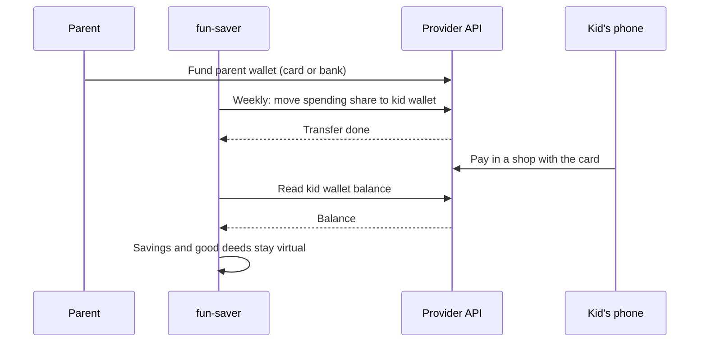

# Real Money for Kids — Provider & Legal Research Dossier

> Reference doc for fun-saver. Written so we never have to research this again.
> Every claim here carries a source and, where possible, a verbatim quote.
> **UNVERIFIED** means no primary source was found — do not treat it as fact.
> This is research, not legal advice.
>
> Companion files:
> - `docs/backlog.md` — what we decided to build later.
> - `docs/research/real-money-provider.html` — the research page: verdict, plan, law and the open questions, filterable by who answers them. Published at [Real Money for Kids](https://claude.ai/artifact/RerAnrrsf2JfPWKJvEscZJ).
> - Shared doc: [fun-saver real-money feasibility](https://claude.ai/code/artifact/7e6d32cc-dbd3-48a8-84d6-fb3f51048625)
>
> Last researched: 2026-09-24.

---

## 1. Summary

- **Feasible only through a licensed provider.** Holding a child's spendable
  balance is a licensed payment service in Israel. fun-saver must never hold the
  money: the provider holds it, fun-saver calls its API.
- **Best candidate: Airwallex.** Its own docs list an *Israel CONSUMER DEBIT*
  card program billed in ILS, with per-card limits, merchant-category blocks,
  ATM blocking, named cards for Apple/Google Pay, and an instant self-serve
  sandbox. **Blockers:** its Israeli licence announcement targets businesses,
  the consumer program needs Airwallex approval, and no minimum cardholder age
  is documented.
- **Runner-up: Rapyd.** Wallet + card API, free sandbox, Israeli licence — but
  its docs do not say whether it issues cards in Israel, its only published age
  rule is 18+, and the parent would have to be a "company" wallet.
- **No Israeli kids product has an API.** PayBox Young, Poalim Junior, MyCal,
  MyMax and Isracard's kids card work only inside their own apps.
- **Global platforms are ruled out** (Stripe, Adyen, Marqeta, Checkout.com,
  Swan, Wallester, Weavr): no Israeli cardholders.
- **"Parent holds, child uses" is legal and is the Israeli standard.** The
  parent carries the risk for everything the child spends.

---

## 2. The plan

### Goal

Older kids who have a phone get real money they can pay with on their own —
the **spending wallet**, on their phone — while the parent stays in control.

### Decisions so far

| Decision | Why |
| --- | --- |
| The **parent** is the customer and legal account holder (the "uber account"); child accounts sit under them | Matches fun-saver's existing model, and every Israeli kids product is contracted with the parent (§4.7) |
| Only the **spending wallet** becomes real money | The kid must not touch savings, and good deeds must not be spent alone |
| **Savings and good deeds stay virtual**, held by the parent as today | Virtual money is outside the payment law (§4.5); keeps the 50/40/10 split and daily interest unchanged |
| The spending wallet is a **card in the child's name** under the parent's contract, in Apple/Google Pay | Cleaner liability than lending the parent's card (§4.6); no parent credentials in the app |
| A **weekly deposit** tops up the spending wallet | The parent authorises it once and can cancel it (§4.6) |
| fun-saver needs a provider **with an API** | So the weekly transfer and the balance are automatic, not manual |

### Target model

```
Parent (customer, verified)
 └─ Parent wallet at provider  ← funded by parent (card / bank)
     └─ Child wallet at provider ← weekly transfer triggered by fun-saver
         └─ Card in child's name → Apple/Google Pay on child's phone
fun-saver
 ├─ reads child wallet balance → shows it as the spending wallet
 ├─ savings wallet   (virtual, interest simulated, parent holds money)
 └─ good-deeds wallet (virtual, parent holds money)
```



### What fun-saver must build (from the legal findings)

- A card issued **in the child's name** under the parent's contract — never the
  parent's own card, never the parent's login (Payment Services Law s.45א).
- A **weekly allowance** the parent approves once and can cancel with one tap.
- **Freeze** and **report lost** actions that reach the provider immediately —
  nothing after notice is charged to the parent (s.24(ב)).
- **Blocks**: instalments, ATM, gambling, alcohol and tobacco, crypto, money
  transfers, fuel; plus a balance cap.
- The child's details collected for the provider's **beneficiary record** (AML).
- The parent's informed **privacy consent**, a child-friendly notice, and no
  marketing aimed at the child.
- "Interest" on the virtual savings wallet clearly labelled as a **simulation
  paid by the parent**.

### Phases

1. **In-app weekly allowance** (no provider needed). Parent sets amount and
   weekday; the deposit posts itself with the usual split. Reuse the lazy,
   idempotent-per-day pattern in `src/lib/interest-settlement.ts` — no cron.
   The real transfer hooks into this later.
2. **Provider due diligence.** Send the Airwallex and Rapyd sales questions
   (§6); book a fintech lawyer for the legal questions.
3. **Sandbox prototype.** Airwallex sandbox (instant, self-serve): parent
   wallet, child cardholder, weekly transfer, balance read, card controls.
4. **Integration.** Only after a provider confirms consumer + minor support and
   the lawyer confirms fun-saver's role.

**Fallback** if no provider accepts: fun-saver stays a ledger; the parent loads
real money onto PayBox Young / MyCal by hand; add a "sync balance" action where
the kid or parent types the card balance and the difference is recorded as
spending.

---

## 3. Candidates compared

| Provider | Cards for Israeli residents | ILS | Consumer / minor cardholders | Public API | Sandbox | Verdict |
| --- | --- | --- | --- | --- | --- | --- |
| [Airwallex](https://www.airwallex.com/docs/issuing/supported-card-programs) | Yes: "Israel CONSUMER DEBIT … For platform accounts that have approval to launch a consumer card program only" | Yes | Consumers with approval; minors UNVERIFIED | Yes | Self-serve, instant | Best candidate |
| [Rapyd](https://docs.rapyd.net/en/cards.html) | UNVERIFIED: "Issuing cards is supported in specific countries. Contact your Rapyd sales representative" | UNVERIFIED for cards | Consumer terms say 18+ | Yes | Self-serve, free | Runner-up |
| [Nium](https://docs.nium.com/docs/cards) | Israel on [Visa's partner list](https://partner.visa.com/site/partner-directory/nium.html); Nium shares countries at onboarding | UNVERIFIED | Individuals yes; minors UNVERIFIED | Yes | UNVERIFIED | Sales-led, possible |
| [Thredd](https://docs.thredd.ai/More_Information/Regions.htm) | Israel on its regions list | UNVERIFIED | Processor only; needs a separate issuer | Yes | UNVERIFIED | Not alone |
| PayBox Young, Poalim Junior, MyCal, MyMax, Isracard | Yes | Yes | Yes, from age 8 | No | No | Right product, closed |
| [Stripe Issuing](https://docs.stripe.com/issuing/global) | No: 22 countries, no Israel | No (USD/EUR/GBP) | — | Yes | Yes | Ruled out |
| [Adyen](https://docs.adyen.com/issuing), [Checkout.com](https://www.checkout.com/docs/card-issuing/set-up-card-program), [Swan](https://docs.swan.io/partnership/overview/country-coverage), [Wallester](https://www.wallester.com/faq), [Weavr](https://www.weavr.io/solutions/), [Marqeta](https://www.marqeta.com/services_and_system) | No: EEA/UK/US only | No | — | Yes | Varies | Ruled out |
| [Wise](https://wise.com/help/articles/5C80ujZDqlyryoCgCVvWbq), Revolut, GoHenry, Greenlight, Rooster, Modak | Kids cards not offered in Israel | — | Kids yes, elsewhere | No partner API | — | Ruled out |

---

## 4. Findings by track

### 4.1 First scan — Bit, PayBox, gateways, Stripe

- Bit and PayBox have **no public API for sending money to a person**; they
  offer merchant checkout only, via Israeli gateways.
- Bit via gateways: "Transaction limits are up to 5,000 ILS per transaction and
  20,000 ILS per month", ILS only — [Allpay](https://www.allpay.co.il/en/help/bit),
  also [PayMe](https://help.payme.io/hc/en-us/articles/360013964399-Alternative-Payment-Method-Bit).
- Bit for business routes to aggregators (Grow, Gamma, Upay) —
  [bitpay.co.il](https://www.bitpay.co.il/he/bit-for-businesses). A 2020
  announcement of opening Bit's API was, per a secondary source, not implemented
  as of Jan 2022 ([hamichlol](https://www.hamichlol.org.il/Bit)).
- Stripe does not support Israeli merchants; the workaround is a US LLC —
  [doola](https://www.doola.com/stripe-guide/how-to-open-a-stripe-account-in-israel/).
- Collecting parents' money into our own business account = holding funds for
  others → licence needed (§4.5). Not viable.

### 4.2 Israeli providers and kids products

**No off-the-shelf Israeli API exists** for "fund a child's card and read its
balance". Every kids product works only inside the issuer's own app and needs
the parent to be that issuer's customer.

| Provider | Type | API? | Minors | Fit |
| --- | --- | --- | --- | --- |
| [PayBox Young](https://www.payboxapp.com/paybox-young) (Discount; card by Cal) | Kids wallet | None found. A [Postman "PayBox Developers"](https://documenter.getpostman.com/view/1500986/TWDcEZfV) page exists but did not render — UNVERIFIED | "ילדים בגילאי 8 עד 18" (children aged 8–18); ₪4.90/month digital, ₪7.90 physical | Ideal product, closed; approach BD |
| [Poalim Junior](https://www.bankhapoalim.co.il/he/poalim-digital/junior) | Bank prepaid | None | From 8; max balance ₪2,500 ([review](https://www.poenta.co.il/article/poalim-junior-review/)) | Parent must bank at Hapoalim |
| [MyCal](https://www.cal-online.co.il/cards/mycal/) | Issuer prepaid | None | Any age; one-off or recurring loads | Closed |
| [MyMax](https://www.max.co.il/cards/my-max) | Issuer prepaid | [Portal](https://developers.max.co.il/max/openbanking/product) is read-only open banking only | Yes | Cannot load a card |
| [Isracard prepaid](https://www.isracard.co.il/credit-cards/prepaidcard) | Issuer prepaid | [Portal](https://devportal.isracard.co.il/isracard/prod/product) blocked (403); no issuing API seen — UNVERIFIED | Load ≤ ₪1,000 | Closed |
| [Leumi CASH CARD](https://www.leumi.co.il/he/credit-cards/Cash_Card) | Bank prepaid | None | "מיועד ללקוחות בגיל 14 ומעלה" (14+) | Too old for 8–13 |
| Discount, Mizrahi teen plans | Bank | UNVERIFIED | 14+ (secondary only) | Unlikely |
| [Bank of Jerusalem](https://www.bankjerusalem.co.il/prepaid) | Bank prepaid Mastercard; sponsor behind Rewire, Easyway | [Open banking only](https://apiportal.bankjerusalem.co.il/openbankingbankjerusalem) | UNVERIFIED | Possible bank sponsor |
| STB Union | Licensed non-bank Visa issuer | None public | UNVERIFIED | Says it aims to build "תשתית לשירותי תשלום" (payment infrastructure) for partners ([ice.co.il](https://www.ice.co.il/finance/news/article/974175)) — worth approaching |
| Mesh Payments | Corporate cards | Yes ([apis.io](https://apis.io/providers/mesh-payments/)) | No, businesses only | No |
| Rewire (Imagen) | Migrant-worker salary card | None | Adults only | No |
| Nayax (Monyx) | Vending/unattended payments | — | No | No |
| Esh Bank | Digital bank (2026), plans BaaS via Aman | None public | UNVERIFIED | Possible future route |
| [Grow](https://developers.grow.business/), Tranzila, Cardcom, PayPlus, Hyp, iCredit, Gamma, Upay, Sumit | Gateways | Yes, collect only | n/a | Only for the parent paying in |

**ISA licensee register:** the official
[register](https://www.new.isa.gov.il/page/information-payments-operation) is
JavaScript-only and could not be rendered. Per
[Bizportal (Aug 2026)](https://www.bizportal.co.il/capitalmarket/news/article/20039545),
37 licensees include 019, Altshuler Shaham, Leumi Card, BlueSnap, Gamma, Google,
Grow, Nayax, Mesh, PayPal, Revolut, Rewire, SafeCash, STB Union, Visa, WorldCom,
Wise, Upay, Airwallex, Eden (names transliterated — approximate).

### 4.3 Rapyd deep dive

**Verdict: partially feasible on the API side, not confirmed for this use case.**

| Need | What the docs say | Source |
| --- | --- | --- |
| Issuing countries | "Issuing cards is supported in specific countries. Contact your Rapyd sales representative for details." | [Cards](https://docs.rapyd.net/en/cards.html) |
| Card program | "you use different card programs for each country. To request a card program, contact your Rapyd sales representative." | [Issued card](https://docs.rapyd.net/en/issued-card.html) |
| ILS | Only in Disburse payouts and Virtual Account lists, not Collect | [Supported currencies](https://docs.rapyd.net/en/supported-currencies.html) |
| Israel page | Mentions only "Israel Card Acquiring" | [Israel country page](https://www.rapyd.net/network/country/israel/) |
| Wallet per person | "person - The wallet of an individual consumer." | [Create wallet](https://docs.rapyd.net/en/create-wallet.html) |
| Wallet hierarchy | "You can only assign a company wallet as a parent wallet. A person wallet cannot be a parent wallet." | same |
| One contact per person wallet | "Personal wallets have only one personal contact, where company wallets can have multiple contacts" | [Wallet contact](https://docs.rapyd.net/en/wallet-contact.html) |
| Transfers | Recipient must accept each transfer ("The transferee uses this method to accept or decline the transfer."); default expiry 14 days | [Set transfer response](https://docs.rapyd.net/en/set-transfer-response.html), [Transfer funds](https://docs.rapyd.net/en/transfer-funds-between-wallets.html) |
| Scheduled transfers | None found — fun-saver would trigger each week | absence finding |
| Balance | "Retrieve the balances of currency accounts in a Rapyd Wallet." | [Retrieve balances](https://docs.rapyd.net/en/retrieve-balances-of-wallet-accounts.html) |
| Balance cap | "max_balance_limit - The maximum balance that this account can hold." | same; [Set limit](https://docs.rapyd.net/en/set-wallet-account-limit.html) |
| Cards | "You can issue a virtual card for online use or a physical card. The customer's wallet funds the card." | [Issued card](https://docs.rapyd.net/en/issued-card.html) |
| Card requirements | "The contact must have an address and a country." | [Issue card](https://docs.rapyd.net/en/issue-card.html) |
| Merchant/category blocks | Only via Remote Authorization, "Enterprise", "cards are funded by the client wallet" | [Remote authorization](https://docs.rapyd.net/en/remote-authorization.html) |
| Marketing claim | "Set spending limits, decline ATM withdrawals or limit purchases to specific merchants." — no API page found | [Issuing product page](https://www.rapyd.net/products/issuing/) |
| Apple/Google Pay | "You can provision cards issued by Rapyd and add them to a digital wallet such as Apple Pay and Google Pay." In-app provisioning needs PCI-DSS + "special agreement" | [Digital wallet provisioning](https://docs.rapyd.net/en/digital-wallet-provisioning.html) |
| KYC | Contact statuses "not verified" / "KYCd"; limit profiles 0/1/-1/3 | [Create wallet](https://docs.rapyd.net/en/create-wallet.html), [Contact limit webhook](https://docs.rapyd.net/en/contact-limit-change-webhook.html) |
| Age | "You must be at least 18 years of age to open an Account." (Viber wallet terms, not white-label) | [Viber terms](https://www.rapyd.net/viber-terms-and-conditions/), [Checkout terms](https://www.rapyd.net/security-compliance/checkout-terms-of-service/) |
| Sandbox | "Your sandbox account is free and you can set it up yourself." | [Set up your account](https://docs.rapyd.net/en/set-up-your-account.html), [Sign up](https://dashboard.rapyd.net/sign-up) |
| Israeli licence | Rapyd Payments Israel Ltd., Payment Services License, reg. 516003837, ISA; granted 23 Jul 2025 | [Regulatory framework](https://www.rapyd.net/security-compliance/regulatory-framework/), [Ctech](https://www.calcalistech.com/ctechnews/article/rk633zrlxx) |
| Israeli terms | Out of date (still say "submitted an application"); funds held "בחשבון ייעודי ונפרד" (in a dedicated, separate account) | [General terms IL](https://www.rapyd.net/security-compliance/general-terms-il/) |
| Pricing | Contact sales — UNVERIFIED | [Pricing](https://www.rapyd.net/products/pricing/) |

### 4.4 Global issuing platforms

| Platform | Israel cardholders? | ILS? | Minors / consumers | Sandbox | Fit |
| --- | --- | --- | --- | --- | --- |
| **Airwallex** | **Yes** — see §4.7 | **Yes** | Consumers with approval; minors UNVERIFIED | "Your sandbox account will be ready to use instantly." | **Best** |
| Rapyd | UNVERIFIED | UNVERIFIED | 18+ in consumer terms | Free, self-serve | Second |
| Nium | Israel on Visa's list; Nium: countries "documented during the onboarding process" | UNVERIFIED | "individuals or corporate businesses" | UNVERIFIED | Sales-led |
| Thredd | "Israel" on regions list; MuchBetter precedent (UK e-money licence, Mastercard approved for Israel, Feb 2026) | UNVERIFIED | Processor: "use the services of one of these Issuers or set up for self-issuing" | UNVERIFIED | Needs an issuer |
| Stripe Issuing | No: "live with local Issuance in 22 countries" | No: "USD, EUR, or GBP" | — | — | Ruled out |
| Adyen | No: "European Economic Area, the United Kingdom, and the United States" | No | — | — | Ruled out |
| Checkout.com | No: "EEA and in the UK" | No | — | — | Ruled out |
| Swan | No: "valid across the European Economic Area" | No | — | — | Ruled out |
| Wallester | No: "registered in the European Economic Area and United Kingdom" | No | — | Demo | Ruled out |
| Weavr | No: GBP/EUR; entities in BG/UK/MT | No | "consumer and business accounts" | Free | Ruled out |
| Marqeta | No: "US, Canada, UK, EU, and soon APAC and LATAM" | No | — | — | Ruled out |
| Galileo (SoFi) | UNVERIFIED (Americas focus) | — | — | — | Ruled out |
| Paymentology | UNVERIFIED; processor only | — | — | — | Needs an issuer |
| NymCard | UNVERIFIED (GCC, Egypt, Jordan, Iraq) | — | — | "live sandbox" | Ruled out |
| Unlimit | UNVERIFIED (Europe, LatAm) | — | — | — | Ruled out |
| Revolut <18 | ISA licence (Jul 2025), consumer launch in Israel unconfirmed | — | 6–17 elsewhere | No partner API | Ruled out |
| Wise | Adult card yes ("available to personal customers that live in … Israel"); Young Explorer (6–17) only AU, BR, CA, NZ, SG, CH, UK | — | — | Platform for banks | Ruled out for kids |
| GoHenry, Greenlight, Rooster, Modak | UK/US only | No | Kids, elsewhere | No public API | Ruled out |
| Mani | UNVERIFIED — no primary source | — | — | — | — |

Sources: [Airwallex regions](https://www.airwallex.com/docs/issuing/supported-regions-and-currencies),
[Nium](https://docs.nium.com/docs/cards),
[Thredd](https://docs.thredd.ai/More_Information/Regions.htm),
[Stripe](https://docs.stripe.com/issuing/global),
[Adyen](https://docs.adyen.com/issuing),
[Checkout.com](https://www.checkout.com/docs/card-issuing/set-up-card-program),
[Swan](https://docs.swan.io/partnership/overview/country-coverage),
[Wallester](https://www.wallester.com/faq),
[Weavr](https://www.weavr.io/solutions/),
[Marqeta](https://www.marqeta.com/services_and_system),
[Wise card](https://www.wise.com/help/articles/2968915),
[Wise Young Explorer](https://wise.com/help/articles/5C80ujZDqlyryoCgCVvWbq),
[Greenlight partnerships](https://greenlight.com/partnerships),
[Revolut kids](https://www.revolut.com/revolut-kids-and-teens-parent-and-guardians/),
[licences news](https://thepaypers.com/payments/news/revolut-rapyd-airwallex-and-mesh-payments-get-licences-in-israel).

### 4.5 Israeli regulation

All law quotes read from full Nevo texts ("נוסח עדכני" dates noted). Translations are ours.

**What needs a licence** — [Payment Services Licensing Law 2023](https://www.nevo.co.il/law_html/law00/216790.htm) (current to 08-07-2026):

- s.1: "שירותי תשלום – ... (1) ניהול חשבון תשלום; (2) הנפקה של אמצעי תשלום; (3) סליקה של פעולת תשלום; (4) שירות ייזום מתקדם" — managing a payment account, issuing a payment instrument, acquiring, advanced initiation.
- s.2(א): "לא יעסוק אדם במתן שירות תשלום ... אלא אם כן בידו רישיון לכך שניתן מאת הרשות" — no payment service without a licence. "הרשות – רשות ניירות ערך" (the Israel Securities Authority).
- s.2(ד): basic initiation also needs a licence.
- A phone wallet is a payment instrument: "רצף פעולות שעל משלם לבצע לשם מתן הוראת תשלום, בין שהוא כולל שימוש בחפץ או בפרט אימות ובין שאינו כולל" — [Payment Services Law 2019, s.1](https://www.nevo.co.il/law_html/law00/159510.htm).
- In force June 2024 (s.80(א); published 6.6.23).

**Regulated "as a business"** — [ISA staff position on trusts, 9 Dec 2024](https://herzoglaw.co.il/wp-content/uploads/2024/12/staffPosition91224-1.pdf):

- "שירותי תשלום הניתנים באופן עיתי, סדרתי ומתמשך ואשר ניתנים לצדדים רבים, הנטייה היא לראותם כשירותים הטעונים רישוי" — periodic, serial, ongoing services for many parties tend to need a licence.
- "שירותי נאמנות שתכליתם ביצוע תשלומים חודשיים ... מהווים, ככלל, פעילות הנדרשת ברישיון" — trust services making monthly payments generally need a licence. **So fun-saver must not pool parents' money and pay out allowances itself.**

**Agent / program-manager model:** the 2023 law has no agent regime (no hits for שלוח, סוכן, מפיץ, מיקור חוץ). The only channel is the [ISA outsourcing directive (5 Jun 2024)](https://www.new.isa.gov.il/images/Fittings/isa-be/asset_library_pic/al_lobby/al_lobby-63a2db729e575/outsourcing.pdf):

- "הסדר בין חברת תשלומים לבין ספק מיקור חוץ, לפיו אותו ספק ... מבצע ... פונקציה הקשורה בפעילות חברת תשלומים מכוח רישיונה".
- "הוצאת פונקציה למיקור חוץ אינה גורעת מקיום חובותיה ומאחריותה של חברת התשלומים" — the licensee stays responsible.
- s.6: the licensee "היא האחראית באופן מלא לכל פעולה של עובדיה, סוכניה, או של כל ישות המבצעת עבורה פעולות במיקור חוץ".
- s.7(א)(4): account opening/closing policy may not be outsourced.
- Whether a customer-facing branded app counts as an outsourcing supplier — UNVERIFIED.

**Regulators** (2023 law s.1 "מאסדר"): payment companies and basic initiators → ISA; banks → Supervisor of Banks; deposit-and-credit → Supervisor of Financial Service Providers (the Capital Market Commissioner — [Regulated Financial Services Law 2016, s.2(א)](https://www.nevo.co.il/law_html/law00/142263.htm)). Licence types: "רישיון שירותי תשלום או רישיון ייזום בסיסי" — no basic/extended split for payments.

**Small-activity exemption** — [Exemption regulations 2024](https://www.nevo.co.il/law_html/law00/228588.htm), reg. 2(א)(2):

- Total daily balances ≤ ₪5,254,680; per account ≤ ₪1,575, or ≤ ₪3,150 if tied to an identified payer. Excludes cross-border. Index-linked each 1 July (reg. 6).
- Reg. 5: must disclose "כי הוא פטור מרישיון ... ולכן הוא אינו מפוקח על ידי רשות ניירות ערך", including in the app. Law s.3(ב): must notify the ISA.

**Minors — general law** — [Legal Capacity and Guardianship Law 1962](https://www.nevo.co.il/law_html/law00/70325.htm):

- s.3: under 18 is a minor. s.4: "פעולה משפטית של קטין טעונה הסכמת נציגו; ההסכמה יכולה להינתן מראש ... לסוג מסויים של פעולות".
- s.6: acts "שדרכם של קטינים בגילו לעשות כמוה" cannot be voided unless real harm. s.6א: credit/instalment purchases invalid without consent.

**Minors — banks only** — [BOI Directive 416](https://boi.org.il/media/ascl2lho/416_5n.pdf) (v5, 11/00; "הוראות אלו יחולו על תאגיד בנקאי ועל תאגיד עזר"):

- s.5(א): no current account under 14; s.5(ב): under 16 only with parents' written consent.
- s.10(א): "לא ינפיק תאגיד בנקאי כרטיס חיוב לקטין שטרם מלאו לו 16 שנים"; s.10(ג): from 14, cash-withdrawal-only card.
- s.11: credit card needs guardian's written consent. s.12: card marked "קטין" or "נוער (עד 18)". s.13: ATM ≤ ₪400/day. s.6(א): no overdraft without consent.
- Online account opening 16+: [circular h2599](https://boi.org.il/media/a51jtr30/h2599.pdf).
- No ISA rule on minors for payment companies found; the 2023 law never says "קטין". [Directive 470 (payment cards, v16 12/25)](https://www.boi.org.il/media/3nxboqe3/470מונגש.pdf) has no minors provision.

**Open banking** — basic initiation = "ייזום הוראת תשלום, לבקשת לקוח, באמצעות כתיבת פרטי ההוראה אצל מנהל חשבון התשלום ... לאחר שיקבל את אישור המשלם" (2023 law s.1). Banks must give access free (s.35(א), s.39(ג)); applies from ~Dec 2024 (s.80(ב)(1)). [BOI Directive 368](https://boi.org.il/media/2h1jrza3/368_6.pdf) s.30ב–30ג: the customer approves each order online after authentication. [Implementation guidelines](https://boi.org.il/media/fhwbfq1k/111529.pdf) use Berlin Group XS2A. Reading the parent's bank data needs a separate licence — [Financial Information Service Law 2021, s.2(א)](https://www.nevo.co.il/law_html/law00/204508.htm).

**Virtual vs real interest:**

- The 2023 law excludes "פעולת תשלום שלא נעשית בכספים" (7th Schedule, Part A, item 10); "כספים" = "הילך חוקי ... ומטבע חוץ". A virtual ledger is outside the law.
- [Banking (Licensing) Law 1981, s.21(א)](https://www.nevo.co.il/law_html/law00/74691.htm): non-banks may not engage "בקבלת פקדונות כספיים ובמתן אשראי כאחת".
- 2023 law s.24(ו): client funds "לא ישמשו למתן אשראי"; s.24(ד)(3),(ה): the insurance alternative only for a company that "אינה נותנת ללקוח ריבית על יתרת זכות". Paying real interest on held balances is a lawyer question.

**Privacy** — [Privacy Protection Law, Amendment 13](https://www.nevo.co.il/law_html/law00/71631.htm) (current to 14-08-2025):

- Special-category data: "(10) מידע אישי על נתוני שכר של אדם ועל פעילותו הפיננסית".
- s.8א(ב)(1): database of >100,000 people with such data → notify within 30 days. s.17ב1(א)(4): privacy officer at significant scale.
- Consent = "הסכמה מדעת, במפורש או מכללא"; no age of digital consent in the statute. [PPA consent opinion, 25 Feb 2026](https://www.gov.il/BlobFolder/legalinfo/consent-2026/he/cpncent-2025.pdf); [draft age-assurance guidance, 11 Jun 2026](https://www.gov.il/BlobFolder/legalinfo/age-assurance-1/he/age-assurance.pdf). "Parental consent under 16" — UNVERIFIED (search snippet only).
- [Information Security Regulations 2017](https://www.nevo.co.il/law_html/law00/144811.htm) apply (not read in detail).

### 4.6 Parent holds the account, child uses the card — the law

**Legal model in plain words:** the parent contracts with the licensee and is
the "payer". The child is either another "payer" via a card issued for the
child's use under the parent's contract (cleaner), or someone the parent lent
their card to. The child's purchases are the child's own legal acts, validated
in advance by the parent's consent to a type of acts.

**Payment Services Law 2019** ([Nevo](https://www.nevo.co.il/law_html/law00/159510.htm), current to 19-08-2026):

- s.1 "משלם": "...מי שלטובתו מנוהל חשבון תשלום... או מי שהונפק לשימושו אמצעי תשלום" — a payer includes someone for whose use an instrument was issued.
- s.1 "שימוש לרעה": use "בידי מי שאינו זכאי לכך לפי חוזה שירותי התשלום" — misuse is use by someone the **contract** does not entitle. The contract is the pivot: name the child as an authorised user.
- s.1 "הוראת תשלום": "...לרבות אם היא ניתנת באמצעות אחר" — an order can be given through another person.
- No general safeguarding duty on the payer; no "additional card/holder" provision.
- s.24(ג): default cap — lower of ₪75 + ₪30/day, or actual misuse; ₪450 if notice within 30 days.
- **s.24(ד):** "המשלם יהיה אחראי לשימוש לרעה... והגבלת האחריות... לא תחול עליו, אם השימוש באמצעי התשלום נעשה לאחר שהמשלם העמיד את הרכיב החיוני באמצעי התשלום לרשותו של אדם אחר, והכול בין שהשימוש נעשה בידיעת המשלם ובין שנעשה שלא בידיעתו" — no cap once the payer gave the instrument to another person. Exceptions: (1) "למטרת שמירה בלבד"; (2) "נגנב מאותו אדם או אבד לו" — stolen from or lost by that person.
- s.24(ב): no liability after notice. s.22: payer may freeze any time (≤14 days). s.25(ב): none during a freeze. s.27(א): refund within 8 business days. s.31: no liability beyond this chapter. s.51(א): "לא ניתן להתנות על הוראות חוק זה אלא לטובת הלקוח".
- s.45א: no one may, as a business, access a payment account "תוך שימוש בפרטי הגישה של המשלם". **Never store the parent's login.**
- s.11(א): "הוראת תשלום לביצוע עתידי"; s.16: payer may cancel. The weekly allowance is a standing order.
- s.1: a transfer counts even where "המשלם והמוטב הם אותו אדם"; s.48(א)(5) excludes only transfers to a same-customer "חשבון תמורה".

**Ministry of Justice opinion on s.24** (30 Sep 2021, to the Bank of Israel) — [PDF](https://www.gov.il/BlobFolder/reports/phishing-opition/he/internternational-law_media_phishing-opition.pdf). **Verified first-hand**:

> "החוק החריג מהסדר זה נסיבות בהן הלקוח בעצמו מסר את הרכיב החיוני שלו לאחר, מתוך כוונה שאותו אחר יעשה בו שימוש. דוגמא לכך היא הורה שנותן את אמצעי התשלום לילדו או אדם שנותן את אמצעי התשלום לחברו במטרה שירכוש עבורו משהו. בנסיבות אלה, ללקוח יש יחסים עם אותו אדם, ואם אותו אדם עשה באמצעי התשלום שימוש שחורג מההרשאה שהמשלם נתן לו, המחוקק סבר שלא נכון בנסיבות אלה להטיל את האחריות על נותן שירותי התשלום."

**Who bears what:**

| Situation | Who pays | Basis |
| --- | --- | --- |
| Child spends within or beyond what the parent intended | Parent, in full | s.24(ד); MoJ opinion |
| Card lost by / stolen from the child | Parent ≤ ₪450; provider the rest | s.24(ד)(2), s.24(ג) |
| After notice or during a freeze | Nobody on the parent's side | s.24(ב), s.25(ב) |
| Purchase within parent's consent | Valid | Legal Capacity Law s.4 |
| Purchase outside consent | Parent may void within 1 month (claim vs merchant), unless customary for age | s.5, s.6 |
| Instalment purchase | Void without consent | s.6א |
| Alcohol / tobacco / gambling sold to child | Seller | Penal Law [s.193א](https://www.nevo.co.il/law_html/law00/70301.htm) ("המוכר משקה משכר לקטין, דינו – מאסר שישה חודשים"); [tobacco law s.8א](https://www.nevo.co.il/law_html/law00/71594.htm); Penal Law s.225–226 |
| Marketing that exploits the child | App | [Consumer Protection Law s.7א](https://www.nevo.co.il/law_html/law00/70305.htm): "להטעות קטין, לנצל את גילו, תמימותו או חוסר ניסיונו" |

**AML** — [order for payment companies (5 Nov 2024)](https://www.nevo.co.il/law_html/law00/230796.htm), confirmed by [Agmon & Co.](https://www.agmon-law.co.il/צו-איסור-הלבנת-הון-לחברות-תשלומים/):

- s.3(ג): no service to a non-occasional customer "בלא שירשום לגבי נהנה"; "...יחול גם על הוספת נהנה". s.5(א): customer declares "אם הוא פועל בשביל עצמו או בשביל נהנה".
- Beneficiary ([AML Law s.7(א)(1)](https://www.nevo.co.il/law_html/law00/74345.htm)): "אדם שבעבורו או לטובתו מוחזק הרכוש או נעשית פעולה ברכוש, או שביכולתו לכוון פעולה ברכוש". The child likely fits.
- s.4(א)(7): a minor under 16 is identified "לפי מסמך זיהוי של אחד מאפוטרופוסיו".
- Occasional-customer relief (≤ ₪50,000 per half-year; self-declared ≤ ₪500 low-risk) probably does not cover an ongoing parent account. No simplified due diligence for low-value prepaid found.

**App operator exposure:** writing the weekly transfer order via API fits "basic initiation" (s.2(ד), licence) closely; the outsourcing directive is the likely route to work as the licensee's tech provider instead. UNVERIFIED — lawyer question.

### 4.7 How Israeli products and the APIs structure parent and child

**Every Israeli kids product is contracted with the parent; the child only uses the card.**

| Product | Account holder | Ages | Parent liability | Limits | Blocks | Child ID |
| --- | --- | --- | --- | --- | --- | --- |
| [MyMax](https://www.max.co.il/api/umbraco/getImage?imageName=MYMAX-taarifun-mungash-new_amla-6.2024.pdf) (form rev. 5.2025) | Parent: "אני מבקש... להנפיק לי כרטיס/ים"; up to 5 cards; loaded from the parent's Max card | Not stated | "כל נזק שייגרם כתוצאה משימוש של אדם אחר... יהיה באחריותי" | ₪1,000/day load & spend, ₪3,000/month, ₪10,000 max balance | "מספר ענפים"; ATM ≤ ₪400/day, physical only | Only the parent's ID mentioned |
| [MyCal](https://www.cal-online.co.il/cards/mycal/) (Wayback 2026-04-20) | Parent: "צריך כרטיס כאל חוץ בנקאי"; up to 4 cards; shows in parent's app | "בכל הגילאים"; Google Pay 13+, Apple Pay 14+ | UNVERIFIED | ₪1,500/load, ₪5,000/month, ₪10,000 max; lock from parent's app; push to parent, SMS to child | ATM ≤ ₪500/day | UNVERIFIED |
| [PayBox Young](https://www.payboxapp.com/young-tos) | Parent: "החוזה המשפטי הוא בינינו ובין ההורה"; "הכסף ב-Box ילד/ה בבעלות ההורה"; card by Cal | 8–18; "ביום הולדת 18 ... תיחסם" | Parent can use the money and block the child | ₪0–5,000/month, ₪0–400/purchase, Box max ₪5,000, no overdraft | Fuel, tourism; ATM only with physical card | Parent enters child's name, ID, DOB, phone; online use takes the **parent's** ID |
| [Poalim Junior](https://www.bankhapoalim.co.il/he/poalim-digital/junior) | Parent or grandparent with a Hapoalim account; only the orderer can fund | 8+; iPhone 14+, Android 13+ | UNVERIFIED | ₪2,500 max balance & per load, ₪10,000/month, ₪4,000/day | UNVERIFIED | UNVERIFIED |
| [Isracard Nitanchik](https://digital.isracard.co.il/globalassets/isracard/pdf/nitanchick2023.pdf) | Parent ("הלקוח – מי שהכרטיס הונפק לבקשתו"); up to 3 cards | Not stated | "הלקוח אחראי לשלמות הכרטיס ולכל שימוש שייעשה בו" (§7.1) | ₪1,000/load, ₪10,000/year, ₪1,000 max | Gambling, fuel, hotels, car rental, FX, tobacco, adult, political, financial advice | UNVERIFIED |
| Additional card (כרטיס נוסף) | Parent's account, child's name ([Bizportal](https://www.bizportal.co.il/financialconsumerism/news/article/20038888), secondary) | 16+ for banks (Directive 416) | "כל חריגה נופלת על ההורה" | — | — | — |

**APIs:**

| Need | Airwallex | Rapyd |
| --- | --- | --- |
| Cardholder types | "Delegate and Individual"; Individual = "a named individual who is an authorized representative of your business" ([docs](https://www.airwallex.com/docs/issuing/get-started/create-cardholders/cardholder-types)) | Wallets "person", "company", "client"; roles "owner", "agent", "employee" ([create wallet](https://docs.rapyd.net/en/create-wallet.html), [add contact](https://docs.rapyd.net/en/add-contact-to-wallet.html)) |
| Cardholder ≠ account owner | Yes: "an employee, contractor, payout recipient or someone who only has the ability to temporarily access a card belonging to your business" ([docs](https://www.airwallex.com/docs/issuing/get-started/create-cardholders)); commercial cards allow 2 additional cardholders | Only in a company wallet: "a personal wallet can have only one contact... Consider creating a company wallet" |
| Cardholder KYC | Individual: "name, date of birth, email and address mandatory" + `express_consent_obtained`; review states Pending → Verified | "the personal user of the wallet will need to complete the KYC process" |
| Named card in Apple/Google Pay | "the name of the individual will be printed on the card"; wallets "only supported by personalized cards" ([docs](https://www.airwallex.com/docs/issuing/get-started/choose-your-issuing-solution)) | Cards issue to a wallet contact; "Each contact in a wallet can have one or more cards" |
| Consumer cards | "can only be issued to Individual type cardholders"; wallet-funded | — |
| Per-card limits | "This control is mandatory"; PER_TRANSACTION, DAILY… ([docs](https://www.airwallex.com/docs/issuing/card-controls/authorization-controls/transaction-limits)) | Not found; wallet `max_balance_limit` only |
| Merchant categories | `allowed_merchant_categories` ([docs](https://www.airwallex.com/docs/issuing/card-controls/authorization-controls)) | Only via Enterprise remote authorization |
| Block ATM | "CASH_WITHDRAWAL: Blocks ATM withdrawals"; online/contactless/international too ([docs](https://www.airwallex.com/docs/issuing/card-controls/authorization-controls/blocked-transaction-usage-scopes)) | Not found |
| Minimum age | UNVERIFIED | UNVERIFIED |
| Israeli licence scope | **Businesses:** "its full suite of global payment solutions directly to businesses in Israel" ([newsroom, 22 Jul 2025](https://www.airwallex.com/global/newsroom/airwallex-secures-payment-service-license-in-israel-enabling-global-payment-solutions)) — verified first-hand | ISA payment licence; consumer scope UNVERIFIED |

Airwallex Israel, verbatim (re-fetched first-hand):

- "Israel COMMERCIAL DEBIT None Wallet Not required Default program for the region. Used for general business spending."
- "Israel CONSUMER DEBIT None Wallet Not required For platform accounts that have approval to launch a consumer card program only." — [Supported card programs](https://www.airwallex.com/docs/issuing/supported-card-programs)
- "Israel | AUD, SGD, HKD, GBP, USD, EUR, JPY, CAD, NZD, CHF, ILS" — [Regions and currencies](https://www.airwallex.com/docs/issuing/supported-regions-and-currencies)
- "country_code … Required; must be IL"; "Personal ID refers to Teudat Zehut" — [Israel KYC](https://www.airwallex.com/docs/issuing/individual-kyc-requirements/il)

### 4.8 Verification log

| Item | Status |
| --- | --- |
| Airwallex Israel CONSUMER DEBIT + ILS | Re-fetched first-hand ✔ |
| Airwallex licence targets businesses | Re-fetched first-hand ✔ |
| MoJ opinion "הורה שנותן את אמצעי התשלום לילדו" | PDF text extracted first-hand ✔ |
| Law quotes (Nevo), BOI directives, ISA directive | Downloaded full text by research agents ✔ |
| ISA licensee register | Could not render (JS app) — list from Bizportal |
| Isracard developer portal | 403 (Cloudflare) |
| Cal site | HTTP 400 — Wayback snapshot used |
| PayBox Postman docs | Did not render |
| Kol Zchut page on cards for minors | 403 |
| BOI Directive 416 index (newer version?) | Bot check |
| Revolut under-18 terms | 403 |
| Galileo about page | 403 |
| Rapyd pricing wording | Snippet only |
| Google Wallet supervised balance article (Gadgety) | 403 |

---

## 5. Background from the first conversation

Kept because it shaped the plan:

- Kids' prepaid products in Israel found early: PayBox Young, Poalim Junior (launched July 2026, 4% savings deposit), MyCal, Google Wallet supervised balance (Android via Family Link) — [PayBox Young](https://www.payboxapp.com/paybox-young), [Poenta](https://www.poenta.co.il/article/poalim-junior-review/), [Mako](https://www.mako.co.il/finances-consumer/Article-a9b7b995e324f91027.htm), [Google Families](https://support.google.com/families/answer/15877353?hl=iw), [TheMarker](https://www.themarker.com/markets/2025-01-15/ty-article/.premium/00000194-65d0-de89-a5df-65f9880c0000).
- PayBox Young: anyone can send money to it, ₪400 per transfer cap ([Jerusalem Post](https://www.jpost.com/consumerism/article-857215)).
- Apple Pay for minors in Israel is limited; Apple Cash is not available ([Apple Community](https://discussions.apple.com/thread/255555776)).
- Rejected options: pushing money via Bit/PayBox (no API); collecting parents' money via a gateway into our account (licence); read-only open banking of a teen's bank balance (licensed, and most kids have no account).

---

## 6. Open questions

Status: **Open** unless marked. Ordered by what blocks most.

### For Airwallex sales

1. **Does your Israeli licence cover consumer customers (a parent), or businesses only?** — top blocker.
2. What does approval for the Israel consumer card program require? Minimum volumes, fees?
3. Can a child aged 8–17 be the cardholder, with the parent as the verified customer?
4. Which ID works for a child without a Teudat Zehut card?
5. Can a consumer card be issued to someone other than the onboarded individual (parent → child)?
6. Do Israeli-issued cards work in Apple Pay and Google Pay?
7. Can fun-saver (an Israeli company or sole trader) be the platform account? Company location requirements?
8. Recurring / scheduled transfers between wallets — native, or must we trigger them?

### For Rapyd sales

9. Do you issue cards to Israeli residents in ILS? Is a card program available for Israel?
10. Can minors hold a person wallet or card? Can the parent be the KYC'd contact for a child?
11. Can a parent be modelled as a company wallet with the child as a contact, for a consumer use case?
12. Per-card spend limits, MCC blocks, ATM blocks without Enterprise remote authorization?
13. What is our role (program manager, merchant, other)? What does the "special agreement" / PCI-DSS requirement involve?
14. Pricing and minimums.
15. Does the sandbox issue cards without a sales-issued card program?

### For other providers (partnership approaches)

16. PayBox (Discount): would you expose a partner API for PayBox Young? Is the Postman "PayBox Developers" doc yours?
17. Bank of Jerusalem: would you sponsor a prepaid program for a kids app?
18. STB Union: partnership terms for a kids prepaid program; minors allowed?
19. Nium: is Israel in your cardholder countries? Minors?
20. Isracard: what do the two "Cards" APIs on your developer portal do?

### For a fintech lawyer

21. Does triggering transfers through the licensee's API need a basic initiation licence (s.2(ד)), or does an outsourcing agreement cover it?
22. Is a customer-facing branded app under a licensee's contract an outsourcing supplier, or itself providing a payment service?
23. Is the child's sub-wallet a separate "payment account" or part of the parent's?
24. Is the child a "beneficiary" the licensee must record? Separate ID for ages 16–17?
25. Does the ISA impose age, consent or spending limits on payment-company cards for minors (8–15)? Who must be the account holder?
26. Is Directive 416 v5 (11/00) still current?
27. How does s.24(ד) apply to a token on the child's own device with the child's biometrics — "put at another's disposal" or issued to the child?
28. Is recurring approval allowed under Directive 368 / ISA initiation rules, versus a direct debit to the provider?
29. Are exemption thresholds counted per child account or per parent? Can an exempt provider serve children?
30. Is paying real interest on balances permitted (for us or the provider)?
31. Consumer-law exposure of simulated interest aimed at children.
32. How does a parent validly consent under the Privacy Law to storing a child's financial data? Is there an age of digital consent?

### Needs more research

33. Full ISA licensee register (needs a browser) — which licensees serve consumers and minors?
34. Newer version of BOI Directive 416 (Bizportal suggests immediate-debit cards from 14).
35. ISA supervisor directives for prepaid-specific AML relief (only titles reviewed).
36. Name printed on Israeli kids cards (child's or parent's) — no official source.
37. MyCal terms PDF (liability, merchant blocks, child ID).
38. Esh Bank's eOS / Aman BaaS plans — timeline and API.
39. Mani (international prepaid card with Apple/Google Pay) — no primary source found.
40. Revolut <18 launch in Israel.
41. Information Security Regulations 2017 — obligations for storing children's financial data.

---

## 7. Sources

### Airwallex
- [Supported card programs](https://www.airwallex.com/docs/issuing/supported-card-programs)
- [Supported regions and currencies](https://www.airwallex.com/docs/issuing/supported-regions-and-currencies)
- [Israel individual KYC](https://www.airwallex.com/docs/issuing/individual-kyc-requirements/il)
- [Choose your issuing solution](https://www.airwallex.com/docs/issuing/get-started/choose-your-issuing-solution)
- [Create cardholders](https://www.airwallex.com/docs/issuing/get-started/create-cardholders)
- [Cardholder types](https://www.airwallex.com/docs/issuing/get-started/create-cardholders/cardholder-types)
- [Create commercial cards](https://www.airwallex.com/docs/issuing/get-started/create-cards/create-commercial-cards)
- [Authorization controls](https://www.airwallex.com/docs/issuing/card-controls/authorization-controls)
- [Transaction limits](https://www.airwallex.com/docs/issuing/card-controls/authorization-controls/transaction-limits)
- [Blocked transaction usage scopes](https://www.airwallex.com/docs/issuing/card-controls/authorization-controls/blocked-transaction-usage-scopes)
- [Israeli licence announcement](https://www.airwallex.com/global/newsroom/airwallex-secures-payment-service-license-in-israel-enabling-global-payment-solutions)

### Rapyd
- [Cards](https://docs.rapyd.net/en/cards.html) · [Issued card](https://docs.rapyd.net/en/issued-card.html) · [Issue card](https://docs.rapyd.net/en/issue-card.html) · [Rapyd Issuing](https://docs.rapyd.net/en/rapyd-issuing-365115.html)
- [Create wallet](https://docs.rapyd.net/en/create-wallet.html) · [Wallet contact](https://docs.rapyd.net/en/wallet-contact.html) · [Add contact to wallet](https://docs.rapyd.net/en/add-contact-to-wallet.html) · [Wallet](https://docs.rapyd.net/en/wallet-365049.html)
- [Transfer funds between wallets](https://docs.rapyd.net/en/transfer-funds-between-wallets.html) · [Set transfer response](https://docs.rapyd.net/en/set-transfer-response.html)
- [Retrieve balances](https://docs.rapyd.net/en/retrieve-balances-of-wallet-accounts.html) · [Set wallet account limit](https://docs.rapyd.net/en/set-wallet-account-limit.html)
- [Remote authorization](https://docs.rapyd.net/en/remote-authorization.html) · [Digital wallet provisioning](https://docs.rapyd.net/en/digital-wallet-provisioning.html)
- [Contact limit webhook](https://docs.rapyd.net/en/contact-limit-change-webhook.html) · [Supported currencies](https://docs.rapyd.net/en/supported-currencies.html)
- [Set up your account](https://docs.rapyd.net/en/set-up-your-account.html) · [Signing up](https://docs.rapyd.net/en/signing-up-for-an-account.html)
- [Issuing product](https://www.rapyd.net/products/issuing/) · [Pricing](https://www.rapyd.net/products/pricing/) · [Israel country page](https://www.rapyd.net/network/country/israel/)
- [Regulatory framework](https://www.rapyd.net/security-compliance/regulatory-framework/) · [General terms IL](https://www.rapyd.net/security-compliance/general-terms-il/) · [Viber terms](https://www.rapyd.net/viber-terms-and-conditions/) · [Checkout terms](https://www.rapyd.net/security-compliance/checkout-terms-of-service/)

### Other global platforms
- [Stripe Issuing](https://docs.stripe.com/issuing/global) · [Stripe payments in Israel](https://stripe.com/resources/more/payments-in-israel) · [Stripe global](https://stripe.com/global) · [doola](https://www.doola.com/stripe-guide/how-to-open-a-stripe-account-in-israel/)
- [Adyen Issuing](https://docs.adyen.com/issuing) · [Checkout.com](https://www.checkout.com/docs/card-issuing/set-up-card-program) · [Swan](https://docs.swan.io/partnership/overview/country-coverage) · [Wallester](https://www.wallester.com/faq) · [Weavr](https://www.weavr.io/solutions/) · [Marqeta](https://www.marqeta.com/services_and_system)
- [Nium docs](https://docs.nium.com/docs/cards) · [Visa partner directory – Nium](https://partner.visa.com/site/partner-directory/nium.html) · [Thredd regions](https://docs.thredd.ai/More_Information/Regions.htm)
- [Wise card](https://www.wise.com/help/articles/2968915) · [Wise Young Explorer](https://wise.com/help/articles/5C80ujZDqlyryoCgCVvWbq) · [Revolut kids](https://www.revolut.com/revolut-kids-and-teens-parent-and-guardians/) · [Greenlight partnerships](https://greenlight.com/partnerships)
- [SDK.finance comparison](https://sdk.finance/blog/top-10-card-issuing-platforms-a-comprehensive-comparison-for-fintech-businesses/) · [The Paypers – Israel licences](https://thepaypers.com/payments/news/revolut-rapyd-airwallex-and-mesh-payments-get-licences-in-israel) · [The Digital Banker](https://thedigitalbanker.com/revolut-rapyd-airwallex-and-mesh-granted-payments-licences-in-israel/) · [Ctech](https://www.calcalistech.com/ctechnews/article/rk633zrlxx)

### Israeli providers
- [PayBox Young](https://www.payboxapp.com/paybox-young) · [PayBox Young terms](https://www.payboxapp.com/young-tos) · [PayBox business](https://www.payboxapp.com/business) · [Postman "PayBox Developers"](https://documenter.getpostman.com/view/1500986/TWDcEZfV) · [Jerusalem Post](https://www.jpost.com/consumerism/article-857215)
- [Poalim Junior](https://www.bankhapoalim.co.il/he/poalim-digital/junior) · [Poenta review](https://www.poenta.co.il/article/poalim-junior-review/) · [Mako](https://www.mako.co.il/finances-consumer/Article-a9b7b995e324f91027.htm) · [Haaretz](https://www.haaretz.co.il/labels/2026-07-15/ty-article-labels/0000019f-6479-d551-a9bf-6e7bf0250000)
- [MyCal](https://www.cal-online.co.il/cards/mycal/) · [MyMax](https://www.max.co.il/cards/my-max) · [MyMax form](https://www.max.co.il/api/umbraco/getImage?imageName=MYMAX-taarifun-mungash-new_amla-6.2024.pdf) · [Max developer portal](https://developers.max.co.il/max/openbanking/product)
- [Isracard prepaid](https://www.isracard.co.il/credit-cards/prepaidcard) · [Nitanchik agreement](https://digital.isracard.co.il/globalassets/isracard/pdf/nitanchick2023.pdf) · [Isracard developer portal](https://devportal.isracard.co.il/isracard/prod/product)
- [Leumi CASH CARD](https://www.leumi.co.il/he/credit-cards/Cash_Card) · [Bank of Jerusalem prepaid](https://www.bankjerusalem.co.il/prepaid) · [Bank of Jerusalem API portal](https://apiportal.bankjerusalem.co.il/openbankingbankjerusalem)
- [Bit for business](https://www.bitpay.co.il/he/bit-for-businesses) · [Hamichlol – Bit](https://www.hamichlol.org.il/Bit) · [PayMe – Bit](https://help.payme.io/hc/en-us/articles/360013964399-Alternative-Payment-Method-Bit) · [Allpay – Bit](https://www.allpay.co.il/en/help/bit)
- [STB Union – ice.co.il](https://www.ice.co.il/finance/news/article/974175) · [Mesh – apis.io](https://apis.io/providers/mesh-payments/) · [Grow developers](https://developers.grow.business/) · [Tranzila](https://www.tranzila.com/פתרונות-סליקה/) · [Maariv – licences](https://www.maariv.co.il/economy/israel/article-1217091)
- [Bizportal – 37 licences](https://www.bizportal.co.il/capitalmarket/news/article/20039545) · [Bizportal – additional card](https://www.bizportal.co.il/financialconsumerism/news/article/20038888) · [ISA register](https://www.new.isa.gov.il/page/information-payments-operation)
- [Google Wallet for kids](https://support.google.com/families/answer/15877353?hl=iw) · [TheMarker](https://www.themarker.com/markets/2025-01-15/ty-article/.premium/00000194-65d0-de89-a5df-65f9880c0000) · [Apple Community](https://discussions.apple.com/thread/255555776)

### Law and regulation
- [Payment Services Licensing Law 2023](https://www.nevo.co.il/law_html/law00/216790.htm) · [Payment Services Law 2019](https://www.nevo.co.il/law_html/law00/159510.htm) · [Exemption regulations 2024](https://www.nevo.co.il/law_html/law00/228588.htm)
- [Regulated Financial Services Law 2016](https://www.nevo.co.il/law_html/law00/142263.htm) · [Banking (Licensing) Law 1981](https://www.nevo.co.il/law_html/law00/74691.htm) · [Financial Information Service Law 2021](https://www.nevo.co.il/law_html/law00/204508.htm)
- [Legal Capacity and Guardianship Law 1962](https://www.nevo.co.il/law_html/law00/70325.htm) · [Penal Law](https://www.nevo.co.il/law_html/law00/70301.htm) · [Tobacco law](https://www.nevo.co.il/law_html/law00/71594.htm) · [Consumer Protection Law](https://www.nevo.co.il/law_html/law00/70305.htm)
- [AML order for payment companies 2024](https://www.nevo.co.il/law_html/law00/230796.htm) · [AML Law](https://www.nevo.co.il/law_html/law00/74345.htm) · [Agmon & Co. summary](https://www.agmon-law.co.il/צו-איסור-הלבנת-הון-לחברות-תשלומים/)
- [Privacy Protection Law](https://www.nevo.co.il/law_html/law00/71631.htm) · [Information Security Regulations 2017](https://www.nevo.co.il/law_html/law00/144811.htm) · [PPA consent opinion 2026](https://www.gov.il/BlobFolder/legalinfo/consent-2026/he/cpncent-2025.pdf) · [PPA age-assurance draft](https://www.gov.il/BlobFolder/legalinfo/age-assurance-1/he/age-assurance.pdf)
- [ISA outsourcing directive](https://www.new.isa.gov.il/images/Fittings/isa-be/asset_library_pic/al_lobby/al_lobby-63a2db729e575/outsourcing.pdf) · [ISA staff position on trusts](https://herzoglaw.co.il/wp-content/uploads/2024/12/staffPosition91224-1.pdf)
- [MoJ opinion on s.24 (2021)](https://www.gov.il/BlobFolder/reports/phishing-opition/he/internternational-law_media_phishing-opition.pdf)
- [BOI Directive 416](https://boi.org.il/media/ascl2lho/416_5n.pdf) · [BOI Directive 470](https://www.boi.org.il/media/3nxboqe3/470מונגש.pdf) · [BOI Directive 368](https://boi.org.il/media/2h1jrza3/368_6.pdf) · [BOI circular h2599](https://boi.org.il/media/a51jtr30/h2599.pdf) · [BOI open banking guidelines](https://boi.org.il/media/fhwbfq1k/111529.pdf)
- [Bar Law – 2025 summary](https://barlaw.co.il/regulated-payment-services-and-financial-services-in-israel-summary-and-outlook-for-2025/) · [Open Banking Tracker – Israel](https://www.openbankingtracker.com/country/israel)
